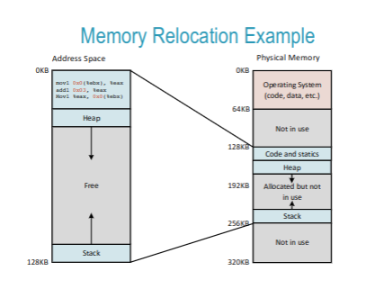
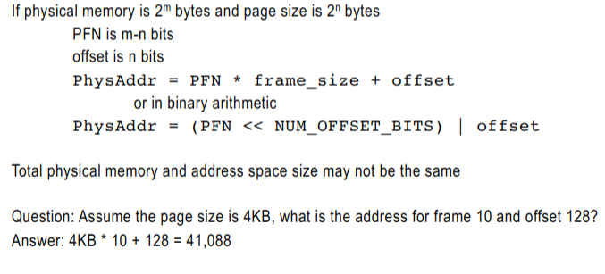

# Intro to Operating Systems

By Matt Tancreti

Operating Systems are mostly written in C

Each process can get virtual CPUs

Memory Virtualisation - programs can write anywhere in the memory

## Program vs Process

_program_ is instructions stored on the disk &rarr; an executable file

_process_ is a running program

|Memory|CPU|

|:---:|:---:|

|Stack|Registers|

|Heap|Program Counter|

|Code|Stack Pointer|

|Static Data||

|process id||

|state = RUNNING||

__Registers__ &rarr; data stored directly on CPU

__Program Counter__ &rarr; which instructions are executed next

__Address Space__ &rarr; where data is stored in memory

__Stack and Frame Pointer__ &rarr; what are the parameters of functions?

## Scheduler

The scheduler is part of the OS

Job is to make sure that only one program is running at once

Context Switch

  Save CPU context of descheduled process

  Load CPU context of descheduled process

Every process must have a _parent_

  When a process is deleted it goes into zombie state, because it may need the exit id

## POSIX (Portable Operating System Interface)

Standard programming interface provided by UNIX like system

## `fork() //Process Creation`

```

pid_t fork()

```

```

printf("A");
fork();
printf("B");
[~]$ A
B
B

```

Creates a new process by duplicating the calling process

Child process has a copy of parent's address space

On Success

  Both parent and child continue execution at the point of return from `fork()`

  `return pid of the child process` to the parent process

  `return 0` to child process

On Failure:

  Does not create child and `returns -1`

Scheduler picks which parent or child process goes first

___Note___: Calling `fork()` twice will create 4 processes

## `wait() // Wait for Child`

```

pid_t wait(int *wstatus)

```

Suspend execution for he parent until one of its children terminates

On Success

  Returns pid of the child process that terminated

## `exec() // Change the Program`

```

int exec(const char *pathname, char *const argv[]);

```

Replaces the current program with a new one, command line args are passed in argv

example usage:

```

char *argv[] = {"wc", "README",0};
exec('wc", argc);

```

# Interprocess Communication

## `|||||||||||||||||||||||||PIPES|||||||||||||||||||||||||`

```

status () {

  echo -n " $(amixer | grep 'Front Left:' | awk '{print $5}') \
  $(date '+%m/%d/%Y ')$(date '+%r' | awk '{print $1}' | \
  sed s/:[0-9][0-9]$//) $(date '+%r' | awk '{print $2}') "

}

```

## `pipe() // Connect two processes`

```

int pipe(int p[2]);

```

On Success

  New file descriptor points to source of provided file descriptor

  Returns new file descriptor

On Failure

  Returns -1

## Limited Direct Execution

__Time-sharing__ &rarr; each process can share the CPU so each can make progress

## How do processes share time?

  multiprogramming - when a process waits for I/O, the OS can have another take of the CPU

  multitasking - each process gets a time-slice, a time limit before the next process gets to execute on the CPU

## How does the OS keep control?

  Hardware provides interrupts, kernel mode, and user mode to keep the user in control

## Direct Execution

Lets the code do everything on the computer

CPU has bit that indicates if in _user mode_ or _kernel mode_

  Cannot read/write outside of address space bounds

  Cannot read/write I/O devices

When in kernel mode, all instructions allowed

Normal processes only execute in user mode, the OS executes in kernel mode

## Process mode

Protects the computer from altering sensitive data

## System Call

Problem: how can users perform privileged operations?

## Jobs

Real processes alternate between needing CPU time and waiting for I/O

Jobs with Time-Sharing, can switch between them when needed

__Preemption__ will kick off processes in the middle of a job before it's done to make sure that other jobs can be done

Metrics

  Time of arrival &rarr; job first enters ready state

  Time of completion &rarr; time when job finishes

  Time of first run &rarr; time when job starts its first run on the CPU

  __Turnaround Time__ = __Time of completion__ - __Time of arrival__

Why different metrics?

  __Turnaround time__ &rarr; tells time to complete jobs, good for CPU bound processes, where getting enough CPU runtime is the main concern

  __Response time__ &rarr; tells how long to respond to I/O, good for I/O bound(interactive) processes, which have short CPU bursts and frequent I/O

  There are other metrics, later we will look at _fairness_

FIFO

  Always pick out job that comes first

  Preemption: None

  Advantage: Easy to implement

  Disadvantage: Large upfront CPU processes can hurt turnaround and response time

Shortest Job First (SJF)

  Always pick out the shortest by job length

  Preemption: None

  Advantage: Optimal average turnaround and response time when all jobs arrive _at the same time_

  Disadvantage: If short jobs arrive after starting a long job?

Shortest Time-to-Completion first (STCF)

  like SJF, but when a new job comes in, it will kick that job off first

  Preemption: if a new job arrive with a shorter time to completion, it preempts

  Advantage: short jobs don't need to wait for a long job to complete

  Disadvantage: sometimes response time can be bad (Bad for I/O bound processes)

Round Robin (RR)

  Implementation: FIFO queue

  Preemption: Job on CPU gets __time-slice__, preempt when time expired

  Advantage: Low response time, Guaranteed response time

  Disadvantage: high turnaround time, and frequent context switches reduce CPU efficiency

Problem with SJF and STCF: Oracle

  Scheduler doesn't know how long it will take for a job to complete

  SJF and STCF needs the ability to see into the future

Multi-Level Feedback Queue

  SJF and STCF have good features, but they require oracle vision and they have serious flaws for some workloads

  RR has low response time, but it treats all jobs equally which can result in poor turnaround time and frequent context switches

  __Rule 1__ &rarr; `if Priority(A) > Priority(B), A runs and B doesn't`

  __Rule 2__ &rarr; `if Priority(A) = Priority(B), A and B run in RR`

## Examples of Common Processes

Process 1: waits for user to press key, performs short task such as adding char to display buffer and then waits for next key press.

Process 2: Perform a long math computation

## CPU bound vs I/O bound processes

  Jobs that need fast response but little CPU time should be highest priority

  Jobs that need long CPU time and little I/O should be lowest priority

  

## Adding Feedback to Multi-Level Queue


  __Rule 3__ &rarr; When a job enters the system, it is placed at the highest priority (the topmost queue)

  __Rule 4a__ &rarr; If a job uses up an entire time slice while running, its priority is reduced

  __Rule 4b__ &rarr; If a job gives up the CPU before the time slice is up, it stays at the same priority level.

## Problem: Starvation

  

  What happens if we turn up the rate of I/O bound jobs?

  One job can freeze if there are too many I/O jobs

## Priority boosts

  

  __Rule 5__ &rarr; After some time period S, move all the jobs in the system to the topmost queue

## Problem: Gaming the System

  

  Smart programmers will catch on: ___"I can make my application run faster if I never let a complete quanta expire"___

  Could add some randomness to the quanta

## Optimization: Lower Priority, Longer Quanta

  

  Longer quanta in the lower queues can reduce frequency of context switches

# The Complete MLFQ

  __Rule 1__ &rarr; `if Priority(A) > Priority(B), A runs and B doesn't`

  __Rule 2__ &rarr; `if Priority(A) = Priority(B), A and B run in RR`

  __Rule 3__ &rarr; When a job enters the system, it is placed at the highest priority (the topmost queue)

  __Rule 4__ &rarr; Once a job uses up its time allotment at a given level (regardless of how many times it has given up the CPU), its priority is reduced (i.e., it moves down one queue).

  __Rule 5__ &rarr; After some time period S, move all the jobs in the system to the topmost queue

## Fair Scheduling

  Each job is assigned numbered _tickets_

  Every time slice, scheduler randomly picks a winning tickets and the job runs for that time slice

  Over time, jobs runtime is proportional to percent of tickets held

### Lottery scheduler doesn't assign priorities how to assign tickets

  In effect, the lottery scheduler is a kind of priority scheduler

 - More tickets means higher priority

 - But, fairer than priority, low ticket jobs can't be completely starved

  For example, how can we create the effect of SJF?

 - Assign number of tickets inversely proportional to each job's runtime

  __Pros__: No job can be starved, everyone gets their fair share of runtime

  __Cons__: A short job can be unlucky and have higher response time

## Stride Scheduling

  Lottery has good fairness over the long run, but randomness can result in suboptimal choices over a short time

  __Stride Scheduling__ is deterministic (not random) but has same fairness

  For each job set its __stride__ is $(10000/ numTickets)$

  Every time a job executes, increment it's _pass_ counter by its _stride_

  Scheduler always picks the job with the lowest pass counter to run next

## Linux Completely Fair Scheduler (CFS)

  CFS gives a proportion of CPU time to each process, there are two questions

  When to preempt the currently running process?

 - Every process assigned a time slice within one `sched_latency`

      - If equal priority, each process gets a $1/N$ slice of `sched_latency`

      - Therefore, every process should run atleast once in `sched_latency`

      - ___Note___: `sched_latency` is scheduler latency

  Which process to run next?

 - The process with the smallest __virtual runtime (vruntime)__

## Nice Values

  Nice value set by user to indicate "priority", weights the $1/N$ time slice a process gets before preemption

```

current_time_slice = 
    current_weight / processes_weights_total * sched_latency

```

  Lower nice value will receive larger time slice

  Higher nice value will receive smaller time slice

  `time_slice` of all processes still add up to `sched_latency`

## Virtual Runtime

  weighted version of the real runtime of each process

  ```

  vruntime = vruntime + (weight ratio based on nice value) * runtime

  ```

  If nice = 0: weight ratio = 1 and vruntime = actual run time

  if nice < 0: weight ratio < 1 and vruntime < actual run time

  if nice > 0: weight ratio > 1 and vruntime > actual run time

## Efficiency

  Scheduler gets called often, efficiency matters

  CFS uses _binary search_ tree to quickly find process with lowest runtime

## Multiprogramming

  Processes share main memory

  Simplest scheme is to assign contiguous regions of memory

  Becomes costly when a process needs to grow its memory

## Process Address Space

  A processes view of memory is called its _address space_

  Address space starts at 0

  Address space is contiguous

  All address available at any time

  At the top are static items(code, global variables, and constants)

  Also need stack which comes from the bottom

## Memory Virtualisation

  

  in reality, the memory for each process is broken up a lot

  However, the OS handles everything so we don't have to think about it

## Base and Bounds Translation

  ```

  128: mov 1000, %eax

  ```

  1. program counter is incremented to 128

  1. CPU beings fetching instructions by reading from address 128

  1. MMU translates 128 to 32,896 and memory is read

  1. CPU decodes instruction and requests a read from address 1000

  1. MMU translates 1000 to 33,768 and memory is read

  1. CPU finishes execution of instructions

## Exception Handling

  Memory access out of bounds results in a trap

  OS typically terminates process

## Hardware Requirements

  | Hardware Requirements | Common Implementation |

  |---|---|

  | Privilege mode | Kernel mode

  | Base and bounds registers

  | Translate virtual address | MMU intercepts all addresses between

  | Privileged instructions to update base and bounds | 

  | Ability to raise exceptions | 

## Segmentation

  Base and bounds means direct translation from address space to physical memory

  Assumes program knows in advance how much dynamic memory will be required

  Growing process's memory dynamically is very difficult

  > How to remove limitations of physical memory from address?

  Problem

 - What happens when address space is full?

 - Using base and bounds, process needs to be copied to a larger space in memory

 - All pointers need to be updated!

```

#include <stdio.h>
#include <stdlib.h>

int main(int argc, char *argv[]) {
  printf("code %p\n", main);
  printf("heap %p\n", malloc(1));
  printf("stack %p\n", &argc[1]);
  return 0;
}

```

Solution:

  Just make the address space massive (up to limits of addressable size)

---

  Just like memory virtualisation, can put anything anywhere

|13|12|11|10|9|8|7|6|5|4|3|2|1|

|---|---|---|---|---|---|---|---|---|---|---|---|---|

|S|S|O|O|O|O|O|O|O|O|O|O|O|

S = Segment

O = Offset

## Independent Direction of Segment Growth

  We can even allow segments to grow in different directions

  A set of registers can indicate if a segment grows up or down

  

## Sharing

  Protection registers can enable sharing

  Example: two processes are executing the same code. If code segment is read-only no danger of processes corrupting each other

  |Segment|Base register|Size register|Grows Positive?|Protection|

  |---|---|---|---|---|

  |Code|32K|2K|1|Read-Execute|

  |Heap|34K|2K|1|Read-Write|

  |Stack|28K|2K|0|Read-Write|

## Free Memory

  Segments are in contiguous regions of physical memory

  To allocate a new segment, OS must keep a list of free memory

  Simple solution is a linked list of free regions of memory

  On a new allocation search for first open spot that has sufficient memory(first fit strategy)

  Best fit strategy searches for smallest regions of free memory that will fit the segment

## Fragmentation

  Segmentation made code, stack and heap independently relocatable

  Segments can become arbitrarily large contiguous

  Resulted in external fragmentation

  Small gaps that are not big enough to put anything there

## Paging

  Address space divided into equal sized pages that can be stored in frames

  

## Page Table

  __Virtual Page Number (VPN)__ is the index of the table

  __Physical Frame Number (PFN)__ points to the frame in physical memory

  __Valid bit__ indicates if table entry is valid(not all of address space needs to be mapped)

  Makes it easy to grow and shrink our process memory, just get to a new page that can be located anywhere

  ---

  

## Virtual Address Bits

  Virtual address divided into VPN and offset

  

  

  If total address space is $2^m$ bytes and page size is $2^n$ bytes

 - VPN is m-n bits

 - offset is n bits

  ___Question___: If address space is $1GB$ and page size is $4KB$ how many bits in the VPN?

 - Answer: $1GB$ = $2^{30}$, $4KB$ = $2^{12}$, therefore VPN is $30-12=18$ bits

 - Check: $4KB$ $\times$ $2^{18}$ = 1GB

  ---

  

## Address Translation

  

## Unused Pages

  Unused pages don't need to be mapped to physical memory

  Process is unaware of pages, when it requests more memory allocated for heap of stack the OS maps pages as needed

## Free Memory Management

  OS needs to know which frames are not in use, simple method is linked list

  No external fragmentation - no unusable gaps between frames

  ---

  

## Page size

  Small page size means bigger page table (more page table entries)

  Bigger page size means more internal fragmentation

  Typical page size is 8KB in Linux

## Basics of the Heap

  Heap is managed at user level provided by language libraries

 - In C `malloc()` and `free()`

 - In Java `new` and the __garbage collector__

  ___Compaction___ (moving allocated spaces together and make larger contiguous free space) not possible for heap

## Problem of External Fragmentation

  want to allocate a 20 byte object, but nowhere to put a 20 byte object, an example of external fragmentation

  A __free list__ is used to track free fragments of memory

## Free space operations

  _splitting_ divides a free space into two parts so one part can be allocated

  _coalescing_ is merging contiguous free spaces into one

      

## Tracking Allocated Regions

  ```

  typedef struct {
    int size;
    int magic;
  } header_t;

  ```

  __size__ &rarr; number of bytes allocated to the program

  __magic__ &rarr; a secret number that can be checked to see if it is the start of the region

  __head__ &rarr; a pointer to the first free region of memory

  __next__ &rarr; points to the next free region of memory or 0 if it is the last region

  Linked list is embedded into the heap

## How to chose a free chunk?

  Is it always best to chose the first free chunk that fits?

  Strategies

 - Best Fit &rarr; find chunk that will result in least fragmentation

 - Worst Fit &rarr; find chunk that will result in the largest left over chunk

 - First Fit &rarr; find first chunk that fits

 - Next Fit &rarr; find the second best chunk that fits

  __Alternate Approaches__:

 - Segregated Lists - manage common sized objects separately

 - Buddy Allocation - tree like structure that allocates blocks in powers of 2

## TLB

  Page table is stored in main memory

  Every memory access requires additional read to loop up page table entry

  Store a cache of "popular" page table entries with the MMU hardware

  Cache can be accessed in single CPU cycle (main memory > 100 cycles!)

## TLB Cache

  Look for VPN in TLB cache

  If found (TLB hist) return entry

  Else (TLB hist) get entry from page table in main memory

  Store entry to cache (possibly replacing some other entry)

## Why does Cache work?

  Spatial locality &rarr; address of memory access is likely to be close to the previous access

  Temporal locality &rarr; addresses likely to repeat in time

## Why does spatial locality exist?

  __Sequential__ memory access is common

  ex: iterating through an array

  ```

  for (int i = 0; i < count; i++) {
     sum += a[i];
  }

  ```

## Replacement Policy

  To add a new TLB cache entry we need to replace an old one, how to pick which to replace?

  Least-recently-used &rarr; replace the entry that was used the longest ago

  Random &rarr; replace a random entry

## Swap

  Users have expectation they can run many programs concurrently

  Memory requirements of all processes combined can easily exceed physical memory

  Observation

 - At any time, many idle processes

 - Only a few pages account for most memory accesses

  __Idea__: rarely used pages can be stored on disk

  ---

  How can OS take advantage of large slow disk space to give illusion of infinite space?

  ---

## Swap Space

  When physical memory is full, less used pages moved to swap space

  Swap space divided into blocks that can hold one page

  Preset Bit

 - Page table has __preset bit__ to indicate if page is in physical memory (`1`) or in swap (`0`)

## What to do when page not present?

  When a program tries to access memory that is on a page currently in swap a page fault occurs

  The page fault is just a trap, it is managed by OS code called the page-fault handler

  The page-fault handler needs to move the page back to main memory

  It may require making room by __swapping__ some other page into swap space

## Why not put everything on disk?

  Main memory is 100x slower than CPU

  SSD drive is 100x slower than main memory

  Swap enables large easy to use address spaces, but cost of page fault is enormous, really want to avoid page faults

## Replacement Policy

  Need to decide on page to evict (page out) so a page can be brought back to memory (page in)

  There are many page-replacement policies, just like we saw with TLB cache 

 - FIFO

 - LRU

 - Random

## Proactive Free Space Management

  Assume main memory is full

 - What happens when use starts a new application?

 - Several page faults! Really slow!

  OS proactively moves pages to swap to always keep a small amount for memory free for responding to sudden activity

  Two thresholds high watermark and low watermark

 - When free memory drops below low watermark OS start background task to start pushing pages to swap space

 - Task stop when free memory passes high watermark

## How to make smaller page tables?

  __Idea:__ One Page table per segment
  
  - use segment number to determine which page table to use

  __Problems:__
  
  - Need to use segmentation (not as flexible as pure paging)

  - Page table size is now dynamic (it can grow and shrink with segment)

    - Needs to be managed as dynamic memory

    - External fragmentation between page tables

  __Idea:__ Multi-Level Page tables
  
  - Chop page tables into page sized units

  - Don't store page table unit where all page table entires are marked invalid

  - Keep a page table directory to record where page table units are located

  - Sub-page tables inside of page tables

  __Advantages:__

  - Grow number of page tables in proportion to size of allocated address space

  - Page tables parts fit into page size chunks of memory

    &rarr; __No external fragmentation__

  __Disadvantages:__

  - Indirection means one extra lookup step to find page table entry

  What about more than one level of indirection?

  - makes the page table size exponentially smaller

  Alternative: Inverted Page Table ___(SUCKS)___

  - Page table index is PFN which translates to VPN (inverted from normal page table)

  - All processes share one big page table

  - Lookup can be made faster using hashtable

## Replacement Policy

__cache hit__ &rarr; page is in main memory

__cache miss__ &rarr; page is in swap space instead

Reference Strings &rarr; if program accesses 0, 0, 0, 1, 1, 1, 2, 0, 1

  - Would be converted to 0, 1, 2, 0, 1

---

_Optimal Comparison_ (not real) &rarr; assume we can predict the future and always chose to evict the page that will be used furthest out (or any page that will never be used again)

First attempt is _FIFO_, despite simplicity not a good choice because causes paradoxical corner-case behavior known as _Belady's anomaly_

  - Advantage:
    - easy to implement and fast (O(1) operations) can be implemented in a fixed size cache using a circular buffer

  - Belady's Anomaly &rarr; more cache space gives a worse performance

Random &rarr; evict from cache at random

  - Advantages

    - easy to implement and fast

    - no corner cases

  - Disadvantages

    - sometimes will kick out a popular page and give lots of misses

LRU (least recently used)

  - evice the page used the least recently

  - Advantages

    - Better performance than FIFO

    - Provable that larger cache size is always a subset of smaller

    - No Belady's anomaly possible

  - Disadvantages

    - slow

    - accounting to do on every single page access

## So which is actually faster?

No locality (completely access was random)

  - Then all of the policies gives the exact same as random

  - cache that can store 50% of total pages only gives 50% hit rate

80-20 Workload (80% of accesses are of 20% of the pages)

  - A few pages get the most accesses

  - Most pages get a few accesses

  - LRU performs the closest to optimal, FIFO and RAND perform the same

Looping-Sequential Workload

  - Assume loop repeatedly reads pages 1 to 49 in increasing order

  - When a cache size is below 50, LRU and FIFO have same corner case that causes every access to be a miss

  - Random avoids corner cases

Clock Algorithm

  - LRU performs the closest in optimal for typical workloads, but it is really costly on every access

  - A way to approximate LRU cheaply

  - Add extra use bit to page table entry, on every memory access MMU set use bit of page to 1

  - When looking for page to evict

    - Visit pages in round-robin order

    - If page use bit is 0, chose that page to evict

    - Else set use bit to 0 and continue search

## Concurrency

2 types

  - Multiprogramming - to utilize the CPU efficiently when programs block for I/O

  - Multitasking - to give all programs a fair slice of the CPU and make progress

What about providing concurrency within a process?
  - Programs have tasks that need to block for I/O
  - Programs want to be responsive to the user while performing tasks in the background

  - Programs want to distribute their computations across multiple CPUs to complete faster

#### What is a thread?

  - multiple points of execution of a program within a single process

  - each thread has is own stack segment

  - Program, data, and heap are shared with the process

#### Thread Control Block

  - Everything that was learned for process scheduling, it is the same for thread scheduling

#### Concurrency vs Parrallelism

__Concurrent__ means multiple threads making progress in time but may be implemented by time-sharing

__Parallel__ means multiple threads instructions executing independently on multiple CPU cores

- __Concurrency__ allows I/O overlap and responsiveness

- __Parallelism__ of threads enables performance increases

## Why use threads?

Threads provide more convenience and better performance

- Simple memory sharing (all threads share same data and heap)

- Lower cost of thread creation (don't need to allocate new address space, just stack)

- Lower cost of context switch (only stack and registers change)

