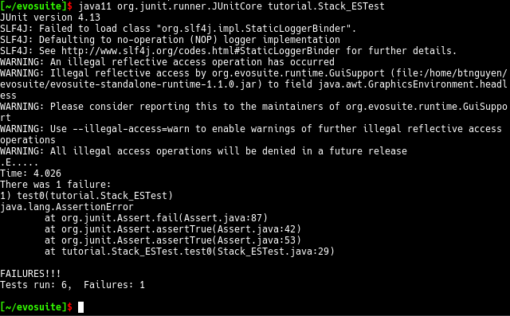
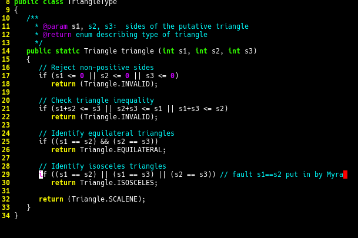
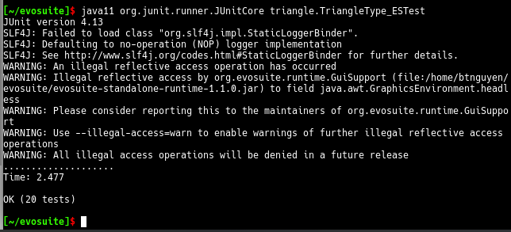
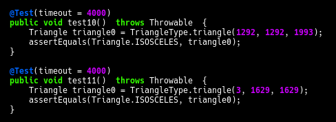
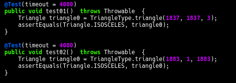
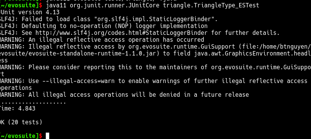

# Assignment 2

#### By Ben Nguyen

## Initial `statistics.csv` output:

```
TARGET_CLASS,criterion,Coverage,Total_Goals,Covered_Goals
tutorial.Stack,LINE;BRANCH;EXCEPTION;WEAKMUTATION;OUTPUT;METHOD;METHODNOEXCEPTION;CBR      ANCH,0.9423469387755102,87,87
triangle.TriangleType,LINE;BRANCH;EXCEPTION;WEAKMUTATION;OUTPUT;METHOD;METHODNOEXCEPT      ION;CBRANCH,0.9255043086564826,173,169
```

## 1

a. how many tests are there in each program?

- Triangle = 19 tests

- Tutorial = 6 tests

b. Show an example of one test for ISOSCELES

```
@Test(timeout = 4000)
public void test01()  throws Throwable  {
    Triangle triangle0 = TriangleType.triangle(1098, 1098, 1606);
    assertEquals(Triangle.ISOSCELES, triangle0);
}
```

c. Show an example of the first stack test

```
@Test(timeout = 4000)
public void test0()  throws Throwable  {
    Stack<Object> stack0 = new Stack<Object>();
    assertTrue(stack0.isEmpty());

    Integer integer0 = new Integer(982);
    stack0.push(stack0);
    stack0.push(integer0);
    stack0.pop();
    assertFalse(stack0.isEmpty());
}
```

## 2

1. Do both of the tests pass?

No, only the Stack passes all tests, the triangle returns a failure

2. Change the oracle for the first Stack Test and recompile/run the tests.
Show the failure as a screenshot.

Failed Test:


3.

Fixed Code:

Fixed Tests:


4.




5.

I have 20 tests cases now

6.


  Now, since the evosuite has been run again with the faulty code, it now assumes that the "faulty" code is all true, and since the evosuite doesn't inherently know what an isosceles triangle is, it will trust that the triangle class knows what an isosceles triangle is, even if the logic there is not sound

7.

