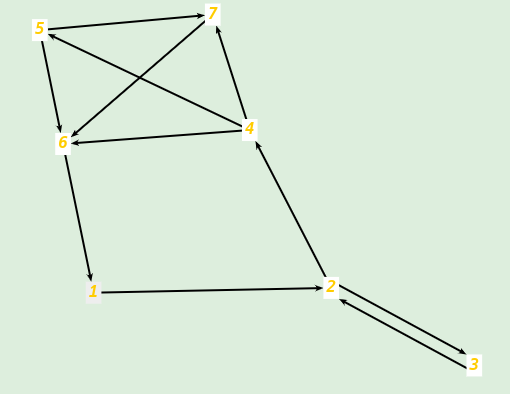
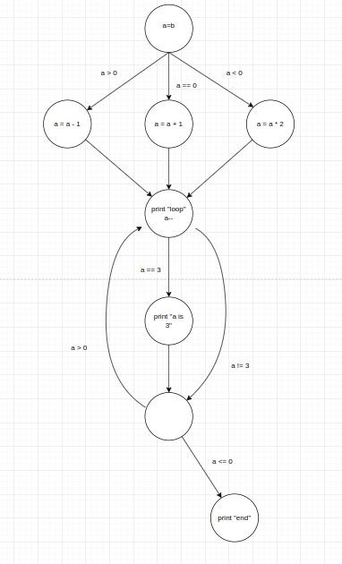
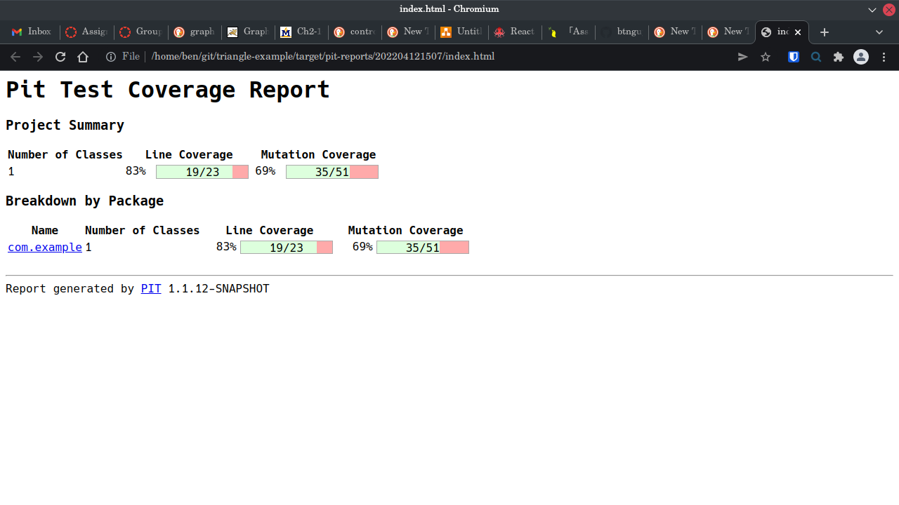
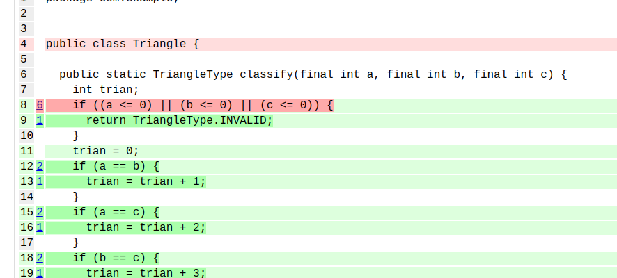

# Assignment 4

by Ben Nguyen

## Q1

a.



b.

102 simple paths required

c.

31 prime paths required

1. [3,2,4,5,7,6,1]
2. [4,5,7,6,1,2,3]
3. [2,4,5,7,6,1,2]
4. [1,2,4,5,7,6,1]
5. [4,5,7,6,1,2,4]
6. [5,7,6,1,2,4,5]
7. [7,6,1,2,4,5,7]
8. [6,1,2,4,5,7,6]
9. [3,2,4,5,6,1]
10. [3,2,4,7,6,1]
11. [4,5,6,1,2,4]
12. [4,5,6,1,2,3]
13. [2,4,7,6,1,2]
14. [1,2,4,5,6,1]
15. [1,2,4,7,6,1]
16. [2,4,5,6,1,2]
17. [4,7,6,1,2,3]
18. [7,6,1,2,4,7]
19. [4,7,6,1,2,4]
20. [5,6,1,2,4,7]
21. [5,6,1,2,4,5]
22. [6,1,2,4,5,6]
23. [6,1,2,4,7,6]
24. [2,4,6,1,2]
25. [3,2,4,6,1]
26. [1,2,4,6,1]
27. [6,1,2,4,6]
28. [4,6,1,2,3]
29. [4,6,1,2,4]
30. [3,2,3]
31. [2,3,2]

d.

- edge coverage is not satisfied
    - Test Paths:
    [1,2,4,5,7,6]
- edge pair coverage is not satisfied
    - Test Paths:
    [1,2,4,5,7,6]
    [1,2,3,2,4,6]
    [1,2,4,7,6]
    [1,2,3,2,3,2,4,6]	
    [1,2,4,5,7,6]
- node coverage is satisfied

## Q2

draw control flow graph

```
a=b
if (a>0) {
    a=a-1
}
else if (a==0) {
   a=a+1
}
else {
   a=a*2
}
while (a>0){
  print "loop"
  a--
  if(a==3) {
   print "a is 3"
  }
}
print "end"
```



## Q3

1. copy output report

```
================================================================================
- Timings
================================================================================
> scan classpath : < 1 second
> coverage and dependency analysis : 13 seconds
> build mutation tests : < 1 second
> run mutation analysis : 16 seconds
--------------------------------------------------------------------------------
> Total  : 30 seconds
--------------------------------------------------------------------------------
================================================================================
- Statistics
================================================================================
>> Generated 51 mutations Killed 35 (69%)
>> Ran 117 tests (2.29 tests per mutation)
================================================================================
- Mutators
================================================================================
> org.pitest.mutationtest.engine.gregor.mutators.ConditionalsBoundaryMutator
>> Generated 10 Killed 0 (0%)
> KILLED 0 SURVIVED 9 TIMED_OUT 0 NON_VIABLE 0
> MEMORY_ERROR 0 NOT_STARTED 0 STARTED 0 RUN_ERROR 0
> NO_COVERAGE 1
--------------------------------------------------------------------------------
> org.pitest.mutationtest.engine.gregor.mutators.RemoveConditionalMutator_EQUAL_ELSE
>> Generated 7 Killed 6 (86%)
> KILLED 6 SURVIVED 0 TIMED_OUT 0 NON_VIABLE 0
> MEMORY_ERROR 0 NOT_STARTED 0 STARTED 0 RUN_ERROR 0
> NO_COVERAGE 1
--------------------------------------------------------------------------------
> org.pitest.mutationtest.engine.gregor.mutators.ReturnValsMutator
>> Generated 8 Killed 6 (75%)
> KILLED 6 SURVIVED 0 TIMED_OUT 0 NON_VIABLE 0
> MEMORY_ERROR 0 NOT_STARTED 0 STARTED 0 RUN_ERROR 0
> NO_COVERAGE 2
--------------------------------------------------------------------------------
> org.pitest.mutationtest.engine.gregor.mutators.MathMutator
>> Generated 9 Killed 8 (89%)
> KILLED 8 SURVIVED 0 TIMED_OUT 0 NON_VIABLE 0
> MEMORY_ERROR 0 NOT_STARTED 0 STARTED 0 RUN_ERROR 0
> NO_COVERAGE 1
--------------------------------------------------------------------------------
> org.pitest.mutationtest.engine.gregor.mutators.NegateConditionalsMutator
>> Generated 17 Killed 15 (88%)
> KILLED 15 SURVIVED 0 TIMED_OUT 0 NON_VIABLE 0
> MEMORY_ERROR 0 NOT_STARTED 0 STARTED 0 RUN_ERROR 0
> NO_COVERAGE 2
--------------------------------------------------------------------------------
[INFO] ------------------------------------------------------------------------
[INFO] BUILD SUCCESS
[INFO] ------------------------------------------------------------------------
[INFO] Total time:  04:11 min
[INFO] Finished at: 2022-04-12T15:08:02-05:00
[INFO] ------------------------------------------------------------------------
[~/coms417/triangle-example]$
```

2. Highlight or provide a summary at the end that states the overall statistics (number of total mutants generated and killed)

```
>> Generated 10 Killed 0 (0%)
>> Generated 7 Killed 6 (86%)
>> Generated 8 Killed 6 (75%)
>> Generated 9 Killed 8 (89%)
>> Generated 17 Killed 15 (88%)
```

- Total Number of Mutants Generated: 10 + 7 + 8 + 9 + 17 = 51

- Total Number of Mutants Killed: 0 + 6 + 6 + 8 + 15 = 35

3. Go to the target/pit-reports directory and copy the report directory to your local machine.  Open up the index.html file. And take a screenshot (handin)



4. Click on com.example and then on triangle.java to show the source code and mutations. Take a screenshot of the mutations for lines 8-22




5. If you hover over the mutants it will tell you what they are and if they survived or were killed. Pick ONE mutation that survived and explain why. Make sure to state which line/mutation it is.

Line number 8
Mutation: change conditional boundary

This mutation survived because there were no tests that completely covered all of the conditions for the mutation.
There was no tests that checked for the very edges of that conditional boundary, so it did not catch the mutation in the test.

## Q4

Briefly identify your team project and list your team members:(5 points) 

My team members are Michael Mila, Brandon Baccam, Christopher Spartz, and Anthony Dang. Our team project is going to be working with React Testing Library. We are interested in the way that React Testing Library can find components of a website just like a user can (through the DOM nodes, instead of the components). This allows your tests to be very close to how a user will interact with the site, giving more confidence that the software will be production ready.
