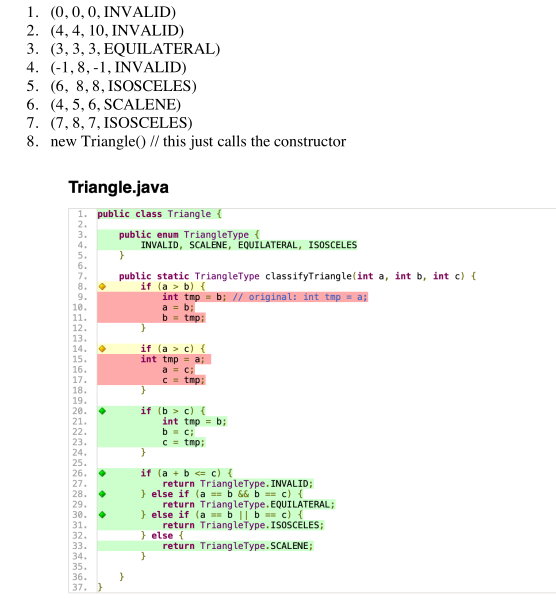

# Exam 1

#### By Benjamin Nguyen (btnguyen)

#### Section: 3:40 - 4:55

## Problem 1



a.

All of the test cases pass when run with JUnit. Explain why this happens using the RIPR model. Be explicit.

The reason that all of the tests pass is because none of the test cases even get to the ___R___ in RIPR, which is Reachability (meaning that the faulty code never gets run). And since the faulty code never gets run, it never gets to the other steps in the RIPR process, which are infection, propagation, and revealability. Meaning that the process never manifests in an error or fault in the program

None of the tests cases ever reaches the broken code on line 9, because for all the tests, a $\ge$ b.

Since all of them have a $\ge$ b, there is no way for any of them to pass the if statement on line 8, meaning that the piece of faulty code never gets run.

```java
if (a > b) { // <= this is always false for the test cases
    //error in code
}
```

&uarr;

Unreachable error, so none of the test cases fail.

b.


```java
(1,0,0,INVALID)
```

This test case does give us 100% coverage, because it goes through both the if statements where `(a > b)` and `(a > c)` that start at line 8 and line 14 respectively.

However, this does not reveal the fault because even though the test reaches the error, and it causes an incorrect state, it does not propagate to give an incorrect final state.

`(1,0,0,INVALID)` would have returned `INVALID` anyway, even without the fault

c.


```java
(1,2,2,ISOSCELES)
```

This test would reveal the fault because it would return `EQUILATERAL` instead of `ISOSCELES`.

The test would enter the `if` statement on line 8, and go through the fault on line 9, which would create a state where a=2, b=2, and c=2, whereas if the code was right, it would have been where a=2, b=1, and c=2.

Since we can see that the intended behavior differs from the behavior that the code produces, this test reveals that the program has a fault in it.

d.

```java
(7,8,7,ISOSCELES)
```

This case failed because it will return `EQUILATERAL` instead of `ISOSCELES`.

e.

100 percent branch coverage is no longer possible because line 30 is unreachable.

Line 28's if statement will return true if a is equal to b, which means that that case can no longer occur in line 30, because when a == b is true, then it never gets to line 30 because it returns earlier at line 29

Also, Line 30 cannot get full coverage because there is no case where `(a == b)` is true, but `(b == a)` is not, so there cannot be the case that a == b and b != a, so since that case cannot be covered it cannot get 100% coverage

## Problem 2

4 Characteristics:

- `--show-ends`

  - $b_1$: displays an extra $ at end of every line

    ex in:

    ```
    ----------------------
    Hello  World
    1 2 3 4 5

    ----------------------
    ```

    ex out:

    ```
    ----------------------
    Hello  World$
    1 2 3 4 5$
    $
    ----------------------
    ```

  - $b_2$: does not display an extra $ at end of every line

    ex in:

    ```
    ----------------------
    Hello  World
    1 2 3 4 5

    ----------------------
    ```

    ex out:

    ```
    ----------------------
    Hello  World
    1 2 3 4 5
    
    ----------------------
    ```

- `--number`

  - $b_1$: shows extra numbered output in from of files compared to no flag

    ex in:

    ```
    ----------------------
    Hello  World
    1 2 3 4 5

    ----------------------
    ```

    ex out:

    ```
    ----------------------
    1 Hello  World
    2 1 2 3 4 5
    3 
    ----------------------
    ```

  - $b_2$: does not show extra numbered output in from of files compared to no flag

    ex in:
    ```
    ----------------------
    Hello  World
    1 2 3 4 5

    ----------------------
    ```

    ex out:
    ```
    ----------------------
    Hello  World
    1 2 3 4 5

    ----------------------
    ```

- `--show-tabs`

  - $b_1$: displays ^I

    ex in:

    ```
    ----------------------
    Hello  World
    1 2 3 4 5

    ----------------------
    ```

    ex out:

    ```
    ----------------------
    Hello^IWorld
    1 2 3 4 5

    ----------------------
    ```

  - $b_2$: displays tabs

    ex in:

    ```
    ----------------------
    Hello  World
    1 2 3 4 5

    ----------------------
    ```

    ex out:

    ```
    ----------------------
    Hello  World
    1 2 3 4 5

    ----------------------
    ```

  - $b_3$: displays neither tabs nor ^I

    ex in:

    ```
    ----------------------
    Hello
    ----------------------
    ```

    ex out:

    ```
    ----------------------
    Hello
    ----------------------
    ```

- `--squeeze-blank`

  - $b_1$: has no empty output lines

    ex in:

    ```
    ----------------------
    Hello  World
    1 2 3 4 5

    ----------------------
    ```

    ex out:

    ```
    ----------------------
    Hello  World
    1 2 3 4 5
    ----------------------
    ```

  - $b_2$: has output lines

    ex in:

    ```
    ----------------------
    Hello  World
    1 2 3 4 5

    ----------------------
    ```

    ex out:

    ```
    ----------------------
    Hello  World
    1 2 3 4 5

    ----------------------
    ```

## Problem 3

a.

length 1:

e1 &rarr; e2

e2 &rarr; e3

e2 &rarr; e1

e2 &rarr; e4

e3 &rarr; e5

e4 &rarr; e3

e5 &rarr; e1

e5 &rarr; e2

e5 &rarr; e3

e5 &rarr; e4

e5 &rarr; e5

length 2:

e1 &rarr; e2 &rarr; e3

e1 &rarr; e2 &rarr; e1

e2 &rarr; e3 &rarr; e5

e2 &rarr; e1 &rarr; e2

e2 &rarr; e4 &rarr; e3

e3 &rarr; e5 &rarr; e1

e3 &rarr; e5 &rarr; e2

e3 &rarr; e5 &rarr; e3

e3 &rarr; e5 &rarr; e4

e3 &rarr; e5 &rarr; e5

e4 &rarr; e3 &rarr; e5

e5 &rarr; e3 &rarr; e5

e5 &rarr; e5 &rarr; e1

e5 &rarr; e5 &rarr; e2

e5 &rarr; e5 &rarr; e3

e5 &rarr; e5 &rarr; e4

e5 &rarr; e5 &rarr; e5

b.

There is a coverage subsumption relationship between length 1 and 2 because every test case of length one gets you back to one of the start cases of the problem, meaning that once you have tested all of the cases of length 1, everything after that will be chaining more of the length 1 test cases together to create the length n cases. For example, wherever you go from e5, which is all the states, you will always get to either e1, e2, e3, e4, e5, which all have their length 1 cases covered in the length 1 test cases, meaning that you have already tested all of the cases

c.

The case where e5 is the start needs a reaching event, or in other words a prefix-value (Inputs necessary to put the software into an appropriate state to receive the test case values) because it can only be reached by pressing e3 before to get to the dialog windows.

d.

It is impossible to generate all possible tests because the test cases could go up to an infinite length, for example one test could be alternating between e3 and e5 a million times, and each time you add one alteration between e3 and e5, they would have to make tests for that, meaning that there are an infinite number of tests.

## Problem 4

a.

Evosuite can generate tests for you with the fuzzing functionality, while selenium cannot do that, it can only run tests that you make and give to selenium. Like in the Triangle Program, evosuite could make tests by itself and give them to you.

Evosuite has an automated oracle while selenium has a manual oracle. While testing the triangle program, evosuite could make tests, and set to the oracle to what was given as the output, like when the program made a test where it gave the TriangleType with a = 3, b = 3, and c = 3, and expected back Equilateral

Evosuite works from a code perspective while selenium works from an artifact perspective. Selenium can run an application and then open up a google chrome window and have a test to see if an artifact has shown up on the screen. Evosuite can show you code coverage and places where your code has not been reached yet by tests.

b.

A problem with this approach is that some of the behavior of the program could be unwanted by the programmer, but evosuite's oracle will treat it as a pass. For example in the TriangleType assignment, we put a fault into the program that changed some of the equilateral cases to be wrong, and to be treated as isosceles instead. Evosuite's oracle assigned those cases that the programmer meant to be equilateral as isosceles instead, and marked them as correct even if they were not supposed to be. Small faults that do not break the program can be easily missed by the oracle assigning wrong outputs as correct.

c.

This problem with automated oracles is less of a problem with regression testing because regression testing is mainly used for checking that adding or deleting code somewhere isn't affecting other pieces of the code base in unintended way. Since it is only checking for changes, all we have to know is if behavior of some code has changed, instead of is that behavior 100% correct. Since the regression tests will fail regardless if the tests are put in manually or automated when the code is changed.

One place where we can trust automated testing is when we have two interconnected pieces of code A and B, each relying on each other, and you have automated tests for both of them.

Then, when you start changing A, the automated regression tests of B will fail where there is code that the behavior has changed based on the changes to A's code. We can trust these regression tests for telling us about B because they signal that some behavior has changed somewhere in B, not whether that behavior is correct or not.

## Problem 5

The subsumption relationship is that every test set that satisfies all of the patterns, must also satify all of the shapes, because every shape can have a specified pattern, and if every pattern is specified then that by definition means that you have covered all of the shapes.

Therefore, the patterns set subsumes the shape set in this case.

For example, if you have a test that checks that every image with each one of the patterns does not have a circle shape, then that means by definition you have tested all of the different shapes are also not a circle.

C2 test suite:

```java
notACircle(images.filter("solid"), true);
notACircle(images.filter("striped"), true);
notACircle(images.filter("dotted"), true);
```

C1 test suite:

```java
notACircle(images.filter("square"), true);
notACircle(images.filter("triangle"), true);
notACircle(images.filter("star"), true);
notACircle(images.filter("octogon"), true);
notACircle(images.filter("cloud"), true);
```

## Problem 6

#### Controllability

Controllability can be hard when testing programs because sometimes it just may not be possible for it to always reach every outcome of the code, and thus will be unable to test every part of the program.

For example, if you had a program that would find the outcome of a game based on an internally rolled random number from 1 to 1,000,000,000 where each roll created a unique outcome, there would be almost no way for you to make an efficient test suite for that program that would run in a reasonable amount of time.

You would have to run the program until it went through every single case, which could take years if the calculations are very complex. Therefore, if the program is not controllable enough, it is hard to test.

#### Observability

Observability can be hard when testing because it can sometimes be hard to set the oracles to the correct evalutations to make a useful test case.

For example, let's say that you have a program that gives out one number a second between 1 and 1,000,000. Then there is a function in that program that will never let the number 5 get chosen ever.

The Observability is low for this program, because when the function if run, there is no immediate way to tell if the program is running correctly, there is only a way for you to know if the program is running incorrectly, which is if the program randomly chooses a 5 after the function is called.

There is not an efficient way to test this program because there is no completely 100% way for you to tell if the function is correct or not after the function is called, because it may just be unlucky that the program has not chosen 5 yet, so it has to wait for an indefinite amount of time for either a failure (which would be a 5 showing up) or to wait forever.
