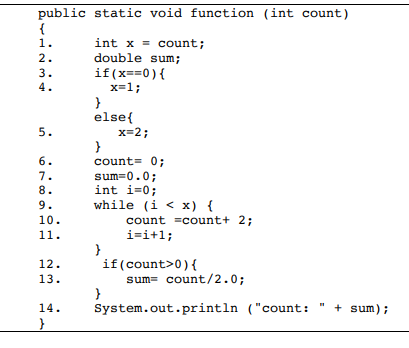

# Coms 417 Software Testing: Exam 2

Last Name: Nguyen

First Name: Benjamin

Section: 1

## Q1 (15 points)

Given this short report from a mutation testing tool, answer the questions below
based on your knowledge of how mutation testing works. (15 points)

Mutants Generated: 100

Mutants Killed: 80

Mutants Survived: 20

a) How many unique programs were created and tested during mutation testing?
Explain. (5 points)

100 unique programs were created and tested because every time there is a mutation created, the program itself is changed to create a unique program

b) What is the mutation score? Show your calculation. (5 points)

<!-- // TODO ask about ratio-->
Mutation score is 0.8 because it killed 80 mutants and generated 100 mutants, so $80/100 = 0.8$

c) Some of the mutants that survived may have been reached (using RIPR). These
may be weak mutants. Explain the difference between a weak mutant and a strong
mutant. Make sure to use RIPR to explain (5 points)

A weak mutant is a program with a mutation that will reach the mutated code, and according to RIPR, it will infect the program, to give an incorrect state, and it will also Propagate out to other parts of the program, however it will not does not have revealability because it does not give an incorrect final state

The difference with a strong mutant is that it will reach the end, and it has revealability, meaning that it will create an incorrect final state that will be picked up by the tests

## Q2 (25 points)

Suppose you have the following TSL file for a small system. Answer the questions
below


a) Suppose you have a test frame with the following set of values:

Key = 1.1.3.2.1.1.

Show the choices that make up this abstract test (i.e map these numbers to the
choice values from the TSL) (5 points)

```
Parameters:
    version: 1_5
    pretty_print: on
    pattern_in_file: many
    logging: off
Environment:
    file: empty
    file_name: bad_name
```

b) List the base choice test cases for this TSL using the following base: (5
points)

Base test: 
```
1_5, off, single, on, non_empty, good_name
```

Other tests:
```
1 | 1_8, off, single, on, non_empty, good_name
2 | 1_11, off, single, on, non_empty, good_name
3 | 1_5, on, single, on, non_empty, good_name
4 | 1_5, off, none, on, non_empty, good_name
5 | 1_5, off, many, on, non_empty, good_name
6 | 1_5, off, single, off, non_empty, good_name
7 | 1_5, off, single, on, empty, good_name
8 | 1_5, off, single, on, non_empty, bad_name
```

c) Now suppose I add the following constraints to the TSL


Identify the 2 constraints and state how they fix 2 different problems from the
test frame in part (b). Use concrete examples. (5 points) 

Constraint 1: If the file is empty, then it cannot have the pattern in it once, or multiple times

This fixes the problem of a file being empty, but also there has to be a pattern in it at the same time, conflicting with the file being empty

Example: Key = 1.1.3.2.1.1.

The key says that the file must be empty, but also must have many of a pattern in the file, which is conflicting

Constraint 2: If the file has a bad name, it will result in an error

This fixes the problem of a file having a bad name, and then it would still run like normal, where instead it should return an error because the program should return an error

Example: Key = 1.1.3.2.1.1.

The keys says that the file must have a bad name, but should not return an error, which conflicts with each other

d) Now assume you have the following CIT sample for the same TSL model (from
part a). Map the first two test cases to the choices from the TSL. Assume that
numberings are assigned in order in the TSL. (5 points)


```
Test 1: 1.1.2.2.1.1
Parameters:
    version: 1_5
    pretty_print: on
    pattern_in_file: single
    logging: off
Environment:
    file: empty
    file_name: bad_name
```

```
Test 2: 1.2.3.1.1.1
Parameters:
    version: 1_5
    pretty_print: off
    pattern_in_file: many
    logging: on
Environment:
    file: empty
    file_name: bad_name
```

e) What are the test requirements for a pairwise sample? Explain using a
concrete example from the model above (5 points)

a pair-wise sample must have at least on instance of each pair of parameters in the set of test cases

For example, Test 2: 1.2.3.1.1.1
This would give the 

## Q3 (25 points)

Given the following Graph answer the questions below


a) Draw the graph (do this either by hand or a drawing tool, but do not paste in
a graph directly from the book website. You can use that tool to help, but not
to supply the final answer. Make sure to differentiate the starting and ending
node. (5 points)

b) Show in detail how to generate the prime paths for this graph starting from
length 1 simple paths and expanding until you have the set of prime paths. You
can skip the length 0 simple paths. You should use the ! and * notation to
indicate paths that can’t be expanded. Make sure to list the final set of prime
paths at the end. (10 points)

c) Is the following a simple path in this graph. Explain why or why not. (5
points)

d) Given the following test paths, does this satisfy edge coverage? If not, list
what coverage is missing and provide additional test paths to reach full
coverage. For each test state what additional coverage it provides. (5 points)

1. [2,1,4,5]
2. [2,1,3,5]
3. [2,4,5]

## Q4 (25 points)

a) Draw a control flow graph for the function below on the next page. List the
basic block statements associated with each node and the predicates indicating
different control flow. Number the nodes (15 points)



b) List all definitions and uses for variables of primitive types (ignore array
types and objects) on their line numbers below. You can have multiple rows for
lines if there is more than one variable with a def/use. (5 points)

|Line #|Variable|Def|Use|
|:---:|:---:|:---:|:---:|
|1||||
|2||||
|3||||
|4||||
|5||||
|6||||
|7||||
|8||||
|9||||
|10||||
|11||||
|12||||
|13||||
|14||||

c) List two def-clear paths. The first should be one for variable x, and the
second should be for variable sum. Both should use the control flow graph in
part a. Use the node numbers to specify the paths (not line number from the
program) (5 points)

## Q5 (10 points)

Answer the following about the program shown below (with output from the pitest
mutation tool) (10 points)


Assume you have the following test suite for this program answer the questions
below. 

|Test#|Test Inputs|Oracle|
|:---:|:---:|:---:|
|1|10,22,30|SCALENE|
|2|1,4,2|INVALID|
|3|4,1,2|INVALID|
|4|50,50,50|EQUILATERAL|
|5|15,15,25|ISCOSCELES|
|6|-1,-1,1|INVALID|
|7|1,1,-1|INVALID|
|8|50,35,25|ISCOSCELES|

a) Line 22 has 3 surviving mutants due to boundary condition mutations. Can
these mutants be killed? If so, list additional test cases that will kill all
three. If not, state why. (5 points)

b) Line 26 has three mutants that replaces addition with subtraction (one for
each conditional). All three are killed. State one of the existing test cases
that killed this. Explain. (5 points)
