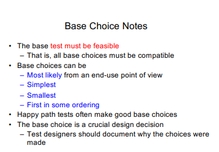
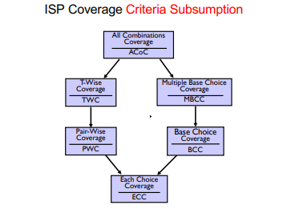
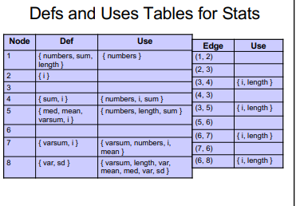
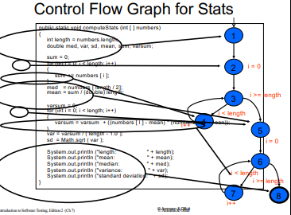

6.2-6.3 Combination Strategies

7.1-7.3 Graph Coverage

9.1-9.2 Syntax and Mutation Testing

- Test Specification consists of a list of categories

- Category consists of a list of choices

- Test specification is used to create a set of test frames

- Test frames are used to create actual test cases

## TSL (Test Specification Language)

- a means of implementing the category partition method

- if we write our test specification using a TSL we can develop test frames

- if a choice always causes an error, it does not  need to be tested in combination with other choices. we can use [error] designation for this

- we can also say that a choice should not be combined with other choices by adding [single]

## All Combinations (ACoC)

All combinations of blocks from all characteristics must be used

Too big because it will cover every single case

## Functionality-Based

have a test for all kinds of returns:

scalene, isosceles but not equilateral, equilateral, invalid

## Each Choice

Each Choice Coverage: one value from each block for each characteristic must be used in at least one test case

## Pair-Wise

Previous two yield very little tests, but are pretty ineffective

have each pair of parameters in the tests

## T-Wise

have t number of characteristics (pair wise but with more)

## Base-Choice

sometimes one set of values is much more important than others

So just have base test case, then alter each values once each different way for all tests

## Multiple Base-Choice

just do multiple base-choices at once

## Combinatorial Interaction Testing (CIT)

Test all pairs or t-way combinations of configuration options, where t is a defined strength of testing

Simple Path: A path from entry node to end node

Prime Path: A simple path that is not a subset of any other simple path

## DU

Def - A declaration of a variable

Use - Where variable's value is accessed

Def-Clear path for variable x - x does not get redefined after the first time it gets defined

## DU Tables

## Control Flow Graph (CFG)

## Mutation testing

actually change the physical code and see if the tests break

if tests do not break, then either dead code or not strong enough tests

## Types of mutants

Dead mutant: A test case has killed it

Stillborn mutant: syntactically illegal

Trivial mutant: Almost every test case can kill it

Equivalent mutant: No test case can kill it (ultra bad bc same behavior as original)

Mutation score: ratio of mutants killed
