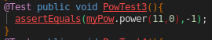
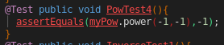

# COMS 417 Assignment 1

#### List the Test cases you have added and for each state:

#### Coverage Before:

---

These reports tell me that there is not enough testing to go through all of the branches, and test all of the code
The inverse method is not tested at all, and there is not enough testing on the power method either

---

- This test is testing lines 24 and 26 in Power.java, going through the case that `right` is <= 0, and that `left` is > 10

---

- This test is testing the big `if` statement on line 24 where both the `left` and `right` are negative

---

- This test is testing the inverse function, going through the branch where `right == 0`

---

- This test is making sure that the `else` statements works on line 63, that the branch returns $right^{left}$

---

#### Coverage After:

#### Maximum Coverage

  - The maximum coverage is 95%, because there is a line of unreachable code, which is because the `if` statement on line 26 will always accept when `right <= 0`, so line 33 will always be covered above on line 26

  ---

  

#### Two Faults not due to numeric overflow

  1. the case $x^0$ will return `-1` because line 26 will return -1 if `right` is zero
  1. any time where the case $x^y$ where y is negative will fail even though it should return $1/x^y$

#### Fixing the Faults

  The fault in this program can be fixed by changing the `right <= 0` to `right < 0`

  

  

#### Finding the overflow
