# Principals of AI

### First Day Orientation

##### Office Hours: Tuesday and Thursday 11am-12:15am

- Textbook and Slides are electronic

- All programming projects in Java

## What is AI?
- __Perception__: Interpretation of data

- __Action__: Accomplishing the task

- __Reasoning__: Apply logical thinking

- __Learning__: Improvement and Adaptation to create better solutions

- __Communication__: Computer output --> human interpretation

- __Planning__: Planning for next solution

  Turing Test: answers indistinguishable from human

  In AI, there are many uncertainties

  Big Difference of AI in _theory_ and in _practice_

## A Brief History

- Start of AI

- Innovation in games

- Collapse after hard to make real world application

- Neural networks regain popularity

- Resurgence after statistics came in

## The State of the Art

- Big data

Pattern and Image recognition

- Deep learning

image recognition

natural language processing

speech recognition

machine translation

## Intelligent Agents

- Agents need to have "perception" which can be mimicked with sensors to have senses _ex: touch sensors, reading, and cameras_

- Agents also need to modify the environment through "actions" _ex: move forward, accelerate, and brake_

- Agent function: takes the environment in, and gives out the action that the Agent should take

### What is considered to be _Rational_?

- Performance measure

- Prior Knowledge

- Performable actions

- Perceptual sequence

  Rational Agents are expected to __maximize__ the performance metric

### Omniscience vs Rationality

- Omniscient agent know the actual outcome of its actions

Impossible in Reality!

- Omniscient agents only happen in games

ex: chess and go

- Rationality maximizes the expected performance

Learn as much as it perceives

Does not require Omniscience

### The nature of environments

##### PEAS
`P`erformance measure

- Save

- Fast

- Legal

- Comfortable trip

- Maximize Profits

- Minimize Impact on other Drivers

`E`nvironment of the agent

- Roads

- Traffic

- Police

- Pedestrians

- Weather

agent's `A`ctuators and `S`ensors

- Steering

- Accelerator

- Brake

- Camera

- Back Sensors

### Fully Observable vs Partially Observable
- Chess &rarr; _Fully_ Observable

can see everything
- Poker &rarr; _Partially_ Observable

cannot see everything

### Dynamic vs Semi-Dynamic vs Static

Dynamic &rarr; does not change state during turns

Semi-Dynamic &rarr; can change state during turns

Static &rarr; other

### Episodic vs Sequential

Episodic &rarr; not based on last outputs

Sequential &rarr; is based on last outputs

## Structure of Agents

Job of AI is to design an agent program that will

perceptions &rarr; actions

### Basic Agent Types

Simple reflex agents

select actions based on current perceptions, and ignore perception history

usually reduces to `if`, `else if`, `else` statements

never improves on past mistakes
- Model-based reflex agents

maintains some internal state of the environment

usually keeps track with features

also reduces to `if`, `else if`, `else` statements, but also will check the environment state
- Goal-based agents

will take the future into account

will try to predict the future
- Utility-based agents

will evaluate current performance, and will try to learn from it

## Problem Solving via Search

Four-Phase Problem Solving
  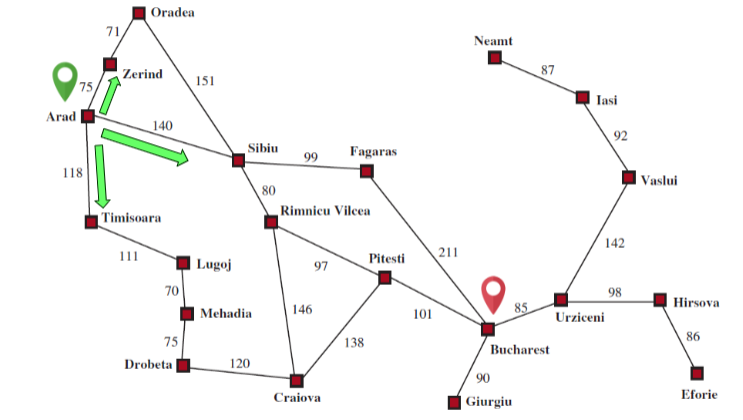
  - Goal formulation
  - Problem formulation
    - states: cities
    - action: travel from one city to another city
  - Search
    - State Space
      - The whole graph
    - Initial State
      - Arad
    - Goal State
      - Bucharest
    - Actions
      - `[toZerind, toSibiu, toTimisoara]`
    - Transition model
      - `RESULT(Arad, ToZerind) = Zerind`
    - Action cost function
      - cost of applying action a in state s to reach s'
    - Solution inital state &rarr; goal state
  - Execution

## Vacuum World
  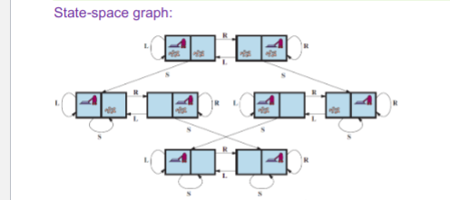

Actions: Suck, Left, Right

Goal: every cell is clean

Cost 1 for each action

## Knuth's Conjecture
  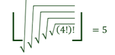

Any integer > 4 can be reached from 4 via a sequence of square root, floor and factorial operations

States: positive real numbers

Initial state: 4

Goal state: the desired integer > 4

Actions: sqrt, floor, or factorial operation

Action Cost: 1

#### Vacuum vs Knuth

Vacuum has _finite_ amount of states, so it can be completely solved

Knuth has _infinite_ amount of states, so DFS will completely fail

#### Queues

Priority queue pops the node with min cost

A FIFO queue pops the first added node (used in BFS)

A LIFO queue pops the most recently added node (used in DFS)

### Performance Measures:

Completeness &rarr; Is the algorithm guaranteed to find a solution whenever one exists, and to report failure otherwise?
  - State space may be infinite!

Cost optimality &rarr; Does it find a solution with the lowest path cost of all solutions?

Time complexity &rarr; Physical time or the number of states/actions to get to desired result

Space complexity &rarr; Memory needed for the search
  - |V| + |E|

Complexity of a problem is measured in:
  - d: _depth_ number of actions in the optimal solution
  - m: _maximum number of actions_ in any path
  - b: _branching factor_ number of successors of a node

## Tree Search

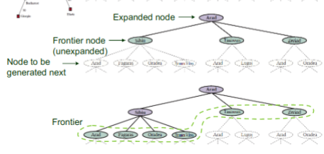

Different search algorithms just choose which frontier node to expand first

#### Best First

uses an evaluation function to expand closest to goal

#### Breadth First

goes down in levels

__Uninformed Search__ &rarr; no clue about how close a state is to the goal

Always find a solution with a minimum number of actions

___Very___ high memory issues and exponential time complexity

#### Depth First

keeps expanding one until it can't

Expand the ___deepest___ node first

Backtrack when can't go down anymore

Returns __first__ solution it finds, not the __cheapest__

Can expand the same state many times

Could get stuck in an _infinite_ loop

Small memory for problems admitting tree-like search

No need for storing entire tree

_Memory Consumption_ = $O(branching Factor * maximum Depth)$

Can avoid an infinite path, add a __depth limit__

#### Iterative Deepening Search
  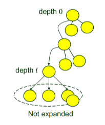

Pick a good value for l by trying all values for l: 1, 2, 3, ...

___Is it actually faster than BFS?___
  - Time: $O(b^d)$ &rarr; __Same as [BFS](#breadth-first)!__
  - Memory: $O(branching Factor * depth Solution)$ &rarr; very small

#### Bidirectional Search
  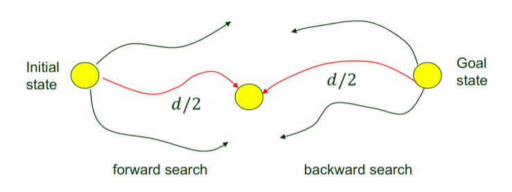

$b^{d/2} + b^{d/2} << b^d$

Can use [BFS](#breadth-first) or [IDS](#iterative-deepening-search) doesn't matter

___Does not work___ for different node costs

#### Informed (Heuristic) Search

based off [BFS](#breadth-first)

Use a function that _estimates_ the cheapest path to the goal

$h(n)$ = _estimated_ cost based on domain
  - $e.g.$ straight line distance

Does not always give the optimal solution
  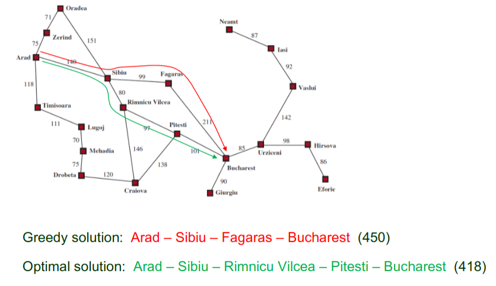

#### A$\ast$ search
  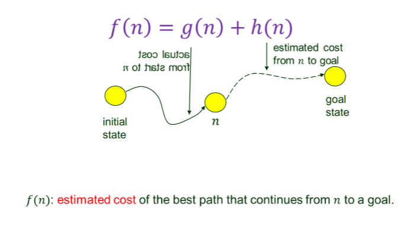
  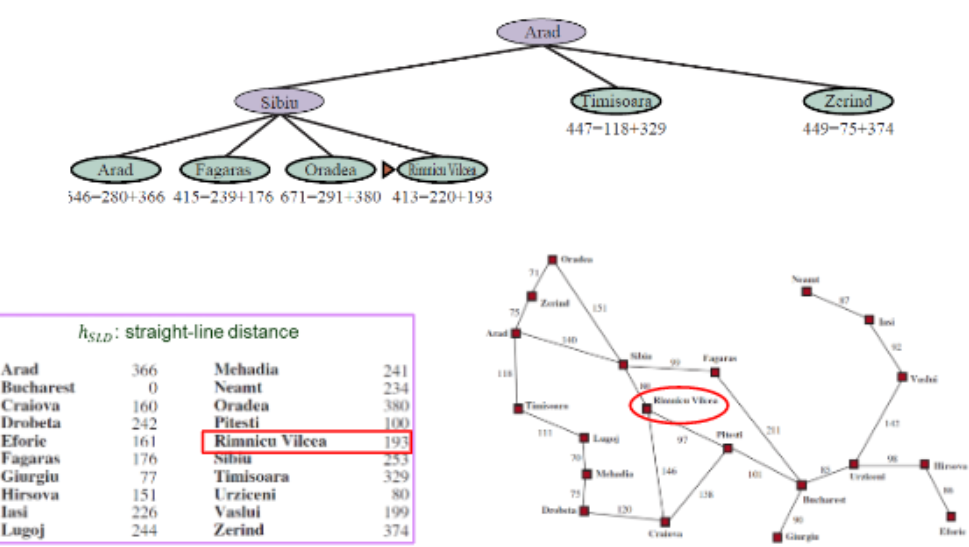
  ___Note___: can go backward from __Arad__ &rarr; __Sibiu__ &rarr; __Arad__

#### Admissible Heuristic

A$\ast$ Search is __complete__ (when the state space either has a solution or is finite)

Whether it is optimal depends on the heuristic.

_Admissible_ = ___never___ overestimates the cost to reach a goal

#### Optimality of A$\ast$
  Proof by Contradiction:

Let ___n___ be the first node on the optimal path that is _unexpanded_

Does not expand that many nodes

#### Dijkstra's Algorithm vs A$\ast$ Search

Dijkstra's Search Contour is a circle around the start node

A$\ast$ 's Search Contour is an oval focused toward the goal

#### Monotonicity

the $g$ cost increases along a path because action costs are positive

$g(n)$ + $h(n)$ $\leqslant$ $g(n)$ + $c(n, a, n')$ + $h(n')$

$h(n)$ $\leqslant$ $c(n, a, n')$ + $h(n')$

#### Efficiency of A$\ast$

h: admissible

C * : cost of the optimal solution path
  - A$\ast$ will expand every node reachable via a sequence of nodes that have costs < C *
  - A$\ast$ will not expand any node with f(n) > C *
  - A$\ast$ might expand a node n with cost f(n) = C * before selecting a goal node

___A$\ast$ prunes away nodes unnecessary for finding an optimal solution___
  - A$\ast$ can take exponential time if the heuristic function is misleading

#### Sacrificing Search (Weighted A$\ast$ Search)

Can use an ___Inadmissible___ Search, to get a faster function, but non-optimal solutions

A$\ast$ Search   &rarr; g(n) + h(n) (W = 1)

Weighted A$\ast$ Search &rarr; g(n) + W * h(n) (1 <= W < Infinity)

#### Memory-Bounded Search

Beam search keeps the k nodes with the best f scores.
  - Less memory and faster execution
  - Incomplete and suboptimal

Iterative-deepening A$\ast$ Search (IDA)
  - The cutoff at each iteration is the f-cost

Steady progress toward the goal if f-cost of every path is an integer

#### Recursive Best-First Search (RBFS)

Space complexity = O(bd)

Slightly more efficient than IDA

Less memory efficient

#### Applying A$\ast$ to 8-puzzle

Two Heuristics
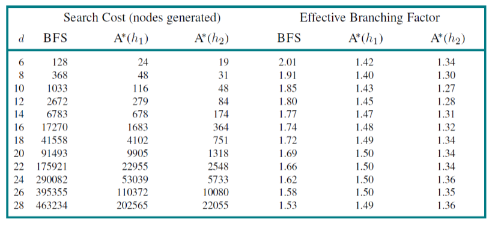
  - h1 = # of tiles displaced
    - Admissible: any tile out of place wil require >= 1 to fix
    - This is too simple
  - h2 = sum of Manhattan distances from their goal positions
    - Admissible: every move reduces the Manhattan distance of only one tile by <= 1

#### Misplaced Tiles vs Manhattan Distance

Given two heuristic functions $h_1$ and $h_2$, we say $h_2$ dominates $h_1$ if $h_2$(n) >= $h_1$(n) at ever node n.

If $h_2$ dominates $h1$, A$\ast$ using $h_2$ will not expand more nodes than using $h_1$

#### Admissibility & Consistency

A solution in the original problem is also a solution in the relaxed problem

But an optimal solution to the relaxed problem may be shorter than an optimal solution to the original problem.

The cost of an optimal solution to the relaxed problem is an admissible heuristic for the original problem.

Such heuristic is an exact cost for the relaxed problem.

#### Heuristics from Formal Specification

A tile can move from square X to square Y if X is adjacent to Y and Y is blank

__Relaxing__ means removing one or two of the conditions

__Dominates__ means gives the heuristic gives more steps
  - A tile can move from square X to square Y if X is adjacent to Y &rarr; __Manhattan Distance__
  - A tile can move from square X to square Y if Y is blank
  - A tile can move from square X to square Y &rarr; __Misplaced Tiles__
  - Both __Manhattan Distance__ and __Misplaced Tiles__ allow the problem to be cut into each of the 8 sub-pieces

Heuristics will slow down because have to execute the heuristic function before expanding a node

## Local Search
  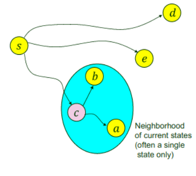

Evaluate and modify one or more _current states_ rather than systematically exploring paths from an initial state

Advantages of Local Search
  - Uses very little memory
  - Finding good solutions in state spaces intractable for a systematic search
  - Useful in pure optimization

#### Hill Climbing
  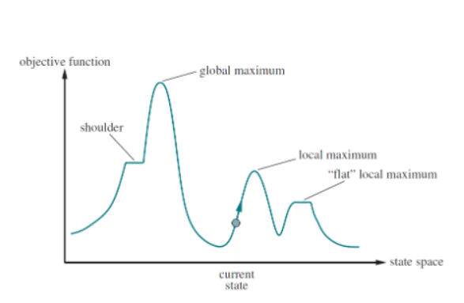
  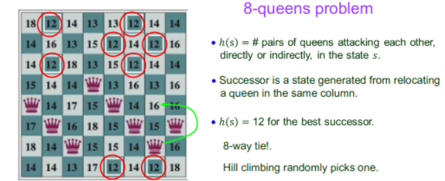
  

Will always try to take the short term best solution

Disadvantages
  - will find local maximums, where it will get stuck

Variations
  - Stochastic hill climbing
    - Random selection among the uphill moves
    - Probability of selection varying with steepness
  - First-choice hill climbing
    - Random generation of successors untila better (than the current) one is found
    - Useful when many successors exist and/or the objective function is costly to evaluate
  - Random restart hill climbing
    - Restart search from random inital state

#### Simulated Annealing

__Annealing__ &rarr; Heat a metal to a high temp and then gradually cool it, allowing the material to reach a low-energy crystalline state so it is hardened.
  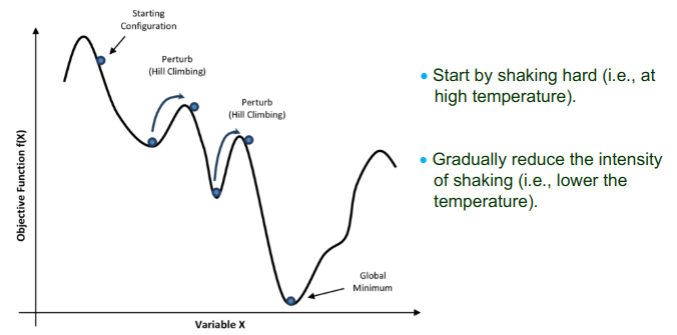

make sure that Temperature(T) approaches 0 slow enough

#### Local Beam Search
  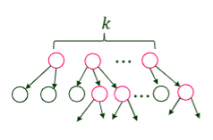

Keep track of k states rather than one
  1. start with k randomly generated states
  1. generate all their successors
  1. Stop if any successor is a goal
  1. Otherwise, keep the k best successors and go back to step 2

#### Evolutionary Algorithms
  1. Start with a population of k randomly generated states (individuals)
  1. Select the _most fit_ individuals to become parents of the next generation
  1. Combine every p parents to form an offspring (typically p = 2).
  1. Restart at step 2 and repeat until _sufficiently fit_

#### Applications of GA

Complex structured problems
    - Circuit layout, job-shop scheduling

Evolving the architecture of deep neural networks

Finding bugs of hardware

Molecular structure optimization

Image processing

Learning robots

## Non-deterministic Actions

Doesn't know the current state

Doesn't know the next state

_belief state_ is a set of physical states believed to be possible by the agent
  - Solution: __conditional plan__ &rarr; gives a set of actions based on what could happen

#### Sensorless Situation

Agent's precepts provide no information at all.

They can be robust due to __zero__ dependence on sensors working properly
  - A sequence of actions from search in the space $B$ of belief states (b-states)
    - Full observability in B: the agent always knows its belief state
  - Transform the physical problem into a belief state problem
  - Apply existing search algorithms

#### Goal test: The goal is achieved

possibly if one of the states $s \in b$ pass

necessary if all of the states $s \in b$ pass

#### Reachable Belief States

DFA for every possible state and transitions between them

#### Partially Observable Environments

Many problems are unsolvable without sensing

A little sensing (e.g only one visible square in the 8-puzzle can go a long way)
    - Can build your knowledge of all states based on previous state

#### Transition Model between b-states

__Prediction__: computes the b-state from an action a.

__Possible percepts__: computes the set of percepts that could be observed in the predicted b-state

__Update__: computes the set of states in b that could have produced the percept

#### Offline vs Online Search

Compute a complete solution before taking the first action

$RESULT(s,a)$ is unknown unless being in $s$ and doing $a$

#### Dead Ends

Can hit dead ends and doesn't know when to stop

#### Expensive search effort

As if the state space is being constructed by an imaginary adversary

#### Nash Equilibrium

Each player has chosen a strategy and no player can increase own expected payoff by changing their own strategy

#### Minimax function

assume that both players play optimally:

- Max moves to a state of maximum value of its turn;

- Min moves to a state of minimum value at its turn;

Complete if the game tree is finite

Optimal against an optimal opponent
  - If Min does not play optimally,
    1. Max will play at least as well as an optimal player
    1. but there may be a better strategy against the suboptimal Min

Three-way ones need to have a different vector values

#### Alpha-Beta Cutoff

number of states is exponential in the depth of the game tree

The cutoff where to algorithm will cut off the that part of the tree

#### Alpha and Beta Values

Alpha-beta pruning gets its name from two extra parameters $\alpha$ $\beta$

Alpha is highest value

Beta is lowest value

[$\alpha$, $\beta$]

# Monte Carlo Tree Search

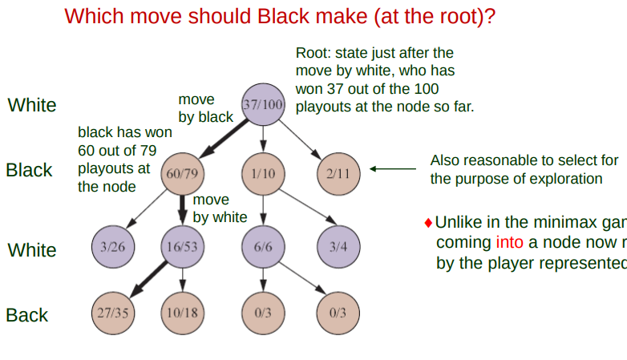

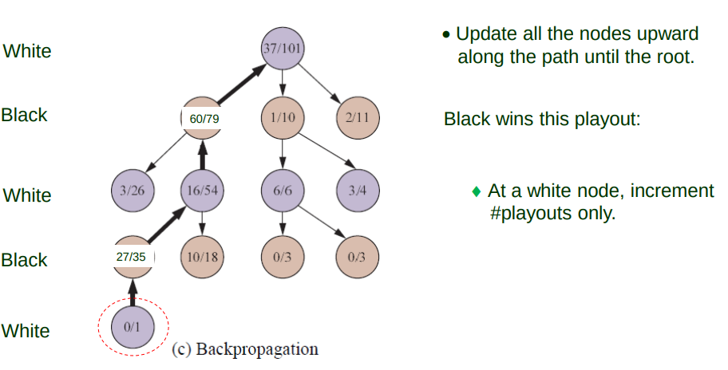

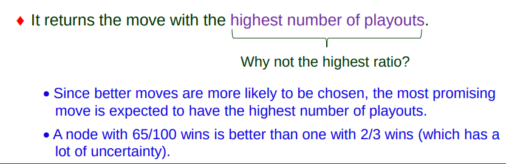

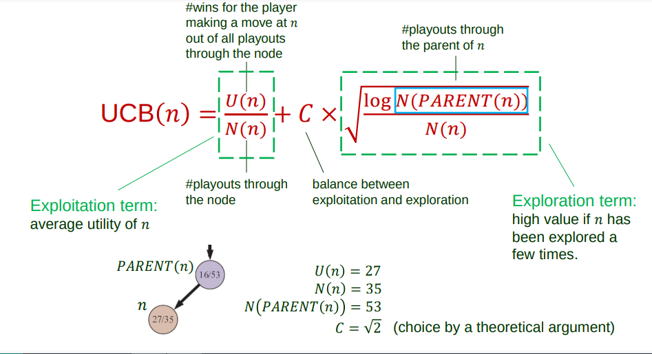

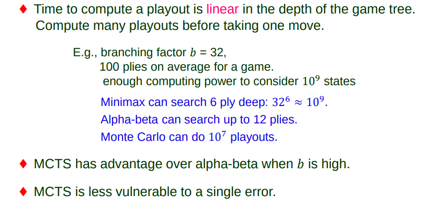

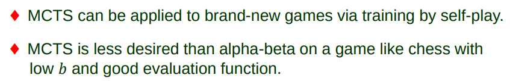

#### Disjunctive Constraint

Four workers installing wheels have to share one tool for axle installment

## Daily Serving Limits

Have objective linear function

- want to minimize cost and maximize food

- but also want to have sufficient nutrients

## Simplex method $O(2^n)$

- Best performance in practice than QuickSort and anything else

__Unary constraint__ &rarr; restricts the value of a single variable SA =/= green

__Binary constraint__ &rarr; relates two variables SA =/= WA

A __higher order constraint__ relate more variables

- Ternary constraint is binary but with three

__Global constraint__ &rarr; involves an arbitrary number of constraints

- Ex: Sudoku has to have all in rows and all in columns and all in boxes as different numbers

__Alldiff constraint__ involves every variable

## Cryptoarithmetic Puzzle

see slides to get picture

??? I have no idea how to do this

#### Constraint Propogation

Use constraints to reduce the number of legal values for a variable, which in turn reduce those for another variable, and so on.

Suppost South Australians dislike green

&darr;

Domain for SA: {red,blue}

__Arc Consistency__ every value that can be assigned to Xi, also has a corresponding value Xj

## Path Consistency

Path consistency checks implicit constraints inferable across triples of variables along a path

Go up from unary constraints to binary to ternary, to solve the problems

## Backtracking Algorithm

Repeatedly chooses an unassigned variable $X$

Treat all values $v_j \in D_i$

## Forward Checking

Every new variable assignment opens the door for new domain reductions on neighboring variables

## Tree Decomposition

Every variable X must appear in at least one tree node n

Two variables X,Y sharing a constraint must appear together in at least one node n

If X appears in two nodes n_1 and n_2, it must appear in every node on the path connecting n_1 and n_2

## Knowledge based agents

Problem solving agents do not know general facts

- An 8 puzzle agent does not know that two tiles cannot occupy the same state space

Their atomic representations are very limited

- a list of all possible concrete states

## Knowledge Base

A knowledge base (kb) is a set of sentences that represents some assertion about the world

An axiom is such a sentence that is taken to be true without being derived from other sentences.

Inference: derive statement form other statements

## Wumpus World

Cave consists of connected rooms

- Some rooms contain pits that will trap whoever enters the room

- The wumpus lurks in one room ready to eat whoever enters the room

- The wumpus can be shot by the agent, who only has one arrow

- The heap of gold is in a different room that where the wumpus lurks

- Wumpus gives off bad smell in North, South, East, West locations

- Pits gives off breeze in North, South, East, West locations

GOAL: Find the gold and bring back to start without being killed

#### Performance measure

- +1000 (climbing out of cave with the gold)

- -1000 (falling into a pit or being eaten by the wumpus)

- -1 (each action taken)

- -10 (using up the arrow)

#### Actuators

1. Forward, TurnLeft by 90, TurnRight by 90
  - will die if go into wumpus or pit

1. Grab
  - Grabs gold in the square

1. Shoot
  - Fire arrow in the direction the agent is facing
  - The arrow continues until hitting the wumpus (or hitting a wall)
1. Climb
  - climb out of cave if at [1][1]

#### Actuators

1. Stench

  - Wumpus nearby

1. Breeze

  - Pit nearby

1. Glitter

  - in the square where the gold is

1. Bump

  - when agent walks into wall

1. Scream

  - when wumpus is killed

## Characteristics of Wumpus world

  Deterministic

  - outcome specified

  Discrete

  -

  Static

  - wumpus does not move

  Single agent

  Partially observable

## Syntax vs Semantics

Syntax &rarr; "x + y = 4" is valid, but "x + + = y" is not

Semantics &rarr; "x + y = 4" is true when x and y add to 4 and false when x = -1 and y = -2

## Monotonicity

Set of entailed sentences can only increase as new information is added to the KB

## Resolution

_sound_ &rarr; $KB$ &vDash; $a$ whenever $KB$ &vdash; $a$

_complete_ &rarr; $KB$ &vdash; $a$ whenever $KB$ &vDash; $a$

Will try to cancel every possibility until only one exists

$l_1$ &or; ... &or; $l_i$ &or; ... &or; $l_k$

If $l_i$ is false, statement now changes to:

$l_1$ &or; ... &or; $l_{i-1}$ &or; $l_{i-1}$ &or; ... &or; $l_k$

## Conjunctive Normal Form

- A conjunction of clauses

## Converting to CNF

A -> B = !A &or; B

To show KB &vDash; a, we show that KB &or; !a is unsatisfiable

## Resolution tree

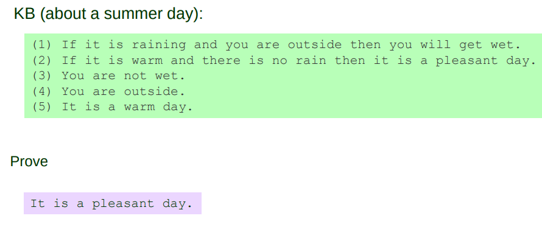

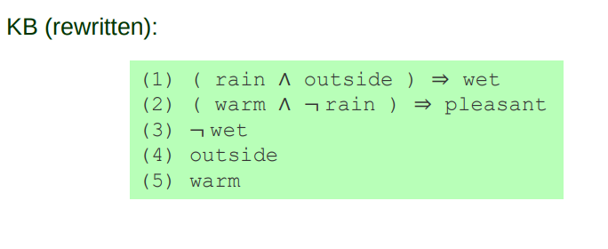

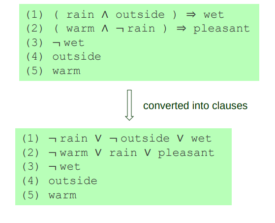

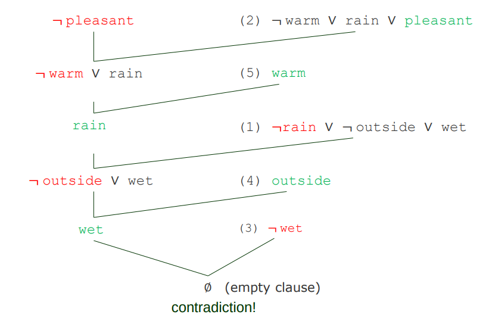

## Ground Resolution Theorem

if $S$ is unsatisfiable, then RC(S) contains the empty clause &empty;
