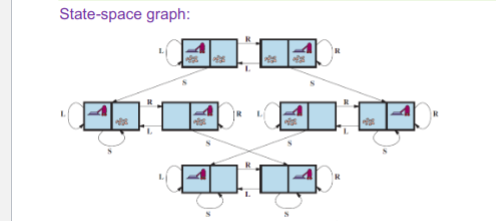
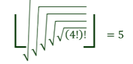
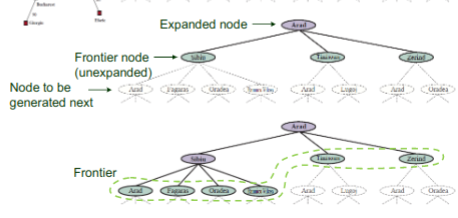
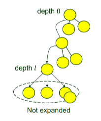
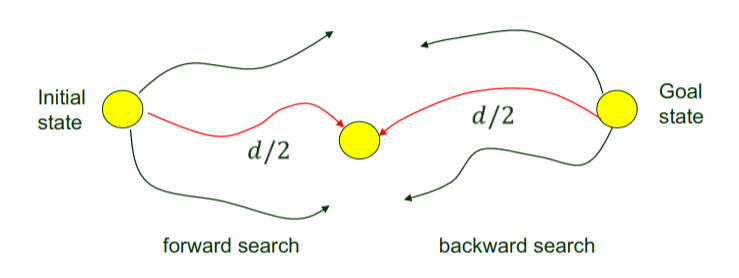
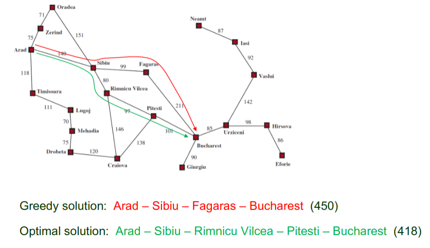
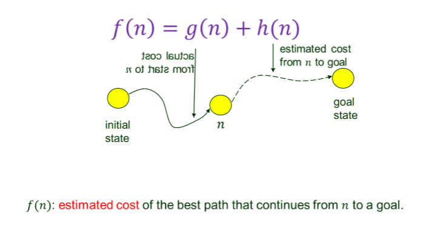

# Principals of AI

___

### First Day Orientation
##### Office Hours: Tuesday and Thursday 11am-12:15am

Textbook and Slides are electronic

All programming projects in Java

___

## What is AI?
- __Perception__: Interpretation of data

- __Action__: Accomplishing the task

- __Reasoning__: Apply logical thinking

- __Learning__: Improvement and Adaptation to create better solutions

- __Communication__: Computer output --> human interpretation

- __Planning__: Planning for next solution

  Turing Test: answers indistinguishable from human

  In AI, there are many uncertainties

  Big Difference of AI in _theory_ and in _practice_

## A Brief History
- Start of AI
- Innovation in games
- Collapse after hard to make real world application
- Neural networks regain popularity
- Resurgence after statistics came in

## The State of the Art
- Big data
  - Pattern and Image recognition
- Deep learning
  - image recognition
  - natural language processing
  - speech recognition
  - machine translation

## Intelligent Agents
- Agents need to have "perception" which can be mimicked with sensors to have senses _ex: touch sensors, reading, and cameras_
- Agents also need to modify the environment through "actions" _ex: move forward, accelerate, and brake_
- Agent function: takes the environment in, and gives out the action that the Agent should take

### What is considered to be _Rational_?
- Performance measure
- Prior Knowledge
- Performable actions
- Perceptual sequence

  Rational Agents are expected to __maximize__ the performance metric

### Omniscience vs Rationality
- Omniscient agent know the actual outcome of its actions
  - Impossible in Reality!
- Omniscient agents only happen in games
  - ex: chess and go
- Rationality maximizes the expected performance
  - Learn as much as it perceives
  - Does not require Omniscience

### The nature of environments
##### PEAS
- `P`erformance measure
  - Save
  - Fast
  - Legal
  - Comfortable trip
  - Maximize Profits
  - Minimize Impact on other Drivers
- `E`nvironment of the agent
  - Roads
  - Traffic
  - Police
  - Pedestrians
  - Weather
- agent's `A`ctuators and `S`ensors
  - Steering
  - Accelerator
  - Brake
  - Camera
  - Back Sensors

### Fully Observable vs Partially Observable
- Chess &rarr; _Fully_ Observable
  - can see everything
- Poker &rarr; _Partially_ Observable
  - cannot see everything

### Dynamic vs Semi-Dynamic vs Static
- Dynamic &rarr; does not change state during turns
- Semi-Dynamic &rarr; can change state during turns
- Static &rarr; other

### Episodic vs Sequential
- Episodic &rarr; not based on last outputs
- Sequential &rarr; is based on last outputs

## Structure of Agents
- Job of AI is to design an agent program that will
  - perceptions &rarr; actions

### Basic Agent Types
- Simple reflex agents
  - select actions based on current perceptions, and ignore perception history
  - usually reduces to `if`, `else if`, `else` statements
  - never improves on past mistakes
- Model-based reflex agents
  - maintains some internal state of the environment
  - usually keeps track with features
  - also reduces to `if`, `else if`, `else` statements, but also will check the environment state
- Goal-based agents
  - will take the future into account
  - will try to predict the future
- Utility-based agents
  - will evaluate current performance, and will try to learn from it

## Problem Solving via Search
  - Four-Phase Problem Solving
    
    - Goal formulation
    - Problem formulation
      - states: cities
      - action: travel from one city to another city
    - Search
      - State Space
        - The whole graph
      - Initial State
        - Arad
      - Goal State
        - Bucharest
      - Actions
        - `[toZerind, toSibiu, toTimisoara]`
      - Transition model
        - `RESULT(Arad, ToZerind) = Zerind`
      - Action cost function
        - cost of applying action a in state s to reach s'
      - Solution inital state &rarr; goal state
    - Execution

## Vacuum World
  
  - Actions: Suck, Left, Right
  - Goal: every cell is clean
  - Cost 1 for each action

## Knuth's Conjecture
  
  - Any integer > 4 can be reached from 4 via a sequence of square root, floor and factorial operations
  - States: positive real numbers
  - Initial state: 4
  - Goal state: the desired integer > 4
  - Actions: sqrt, floor, or factorial operation
  - Action Cost: 1

#### Vacuum vs Knuth
  - Vacuum has _finite_ amount of states, so it can be completely solved
  - Knuth has _infinite_ amount of states, so DFS will completely fail

#### Queues
  - Priority queue pops the node with min cost
  - A FIFO queue pops the first added node (used in BFS)
  - A LIFO queue pops the most recently added node (used in DFS)

### Performance Measures:
  - Completeness &rarr; Is the algorithm guaranteed to find a solution whenever one exists, and to report failure otherwise?
    - State space may be infinite!
  - Cost optimality &rarr; Does it find a solution with the lowest path cost of all solutions?
  - Time complexity &rarr; Physical time or the number of states/actions to get to desired result
  - Space complexity &rarr; Memory needed for the search
    - |V| + |E|
  - Complexity of a problem is measured in:
    - d: _depth_ number of actions in the optimal solution
    - m: _maximum number of actions_ in any path
    - b: _branching factor_ number of successors of a node

## Tree Search
  
  - Different search algorithms just choose which frontier node to expand first
#### Best First
  - uses an evaluation function to expand closest to goal
#### Breadth First
  - goes down in levels
  - __Uninformed Search__ &rarr; no clue about how close a state is to the goal
  - Always find a solution with a minimum number of actions
  - ___Very___ high memory issues and exponential time complexity
#### Depth First
  - keeps expanding one until it can't
  - Expand the ___deepest___ node first
  - Backtrack when can't go down anymore
  - Returns __first__ solution it finds, not the __cheapest__
  - Can expand the same state many times
  - Could get stuck in an _infinite_ loop
  - Small memory for problems admitting tree-like search
  - No need for storing entire tree
  - _Memory Consumption_ = $O(branching Factor * maximum Depth)$
  - Can avoid an infinite path, add a __depth limit__

#### Iterative Deepening Search
  
  - Pick a good value for l by trying all values for l: 1, 2, 3, ...
  - ___Is it actually faster than BFS?___
    - Time: $O(b^d)$ &rarr; __Same as [BFS](#breadth-first)!__
    - Memory: $O(branching Factor * depth Solution)$ &rarr; very small

#### Bidirectional Search
  
  - $b^{d/2} + b^{d/2} << b^d$
  - Can use [BFS](#breadth-first) or [IDS](#iterative-deepening-search) doesn't matter
  - ___Does not work___ for different node costs

#### Informed (Heuristic) Search
  - based off [BFS](#breadth-first)
  - Use a function that _estimates_ the cheapest path to the goal
  - $h(n)$ = _estimated_ cost based on domain
    - $e.g.$ straight line distance
  - Does not always give the optimal solution
  

#### A* search
  
