# COMS 472 Problem Set 1
#### By Ben Nguyen
## 3.2
###### Give a complete problem formulation for each of the following problems. Choose a formulation that is precise enough to be implemented.
###### 1. There are six glass boxes in a row, each with a lock. Each of the first five boxes holds a key unlocking the next box in line; the last box holds a banana. You have the key to the first box, and you want the banana.
---
__Solution__:
  - __State Space__: set of 6 boxes either unlocked or locked
  - __Initial Space__: (Key, Box, Box, Box, Box, Box, Box)
  - __Goal Space__: (Key, Key, Key, Key, Key, Key, Banana)
  - __Actions__: ACTIONS((Key, Key, Key, Key, Key, Key, Box)) = {$openBox$}
  - __Transition Model__: RESULT((Key, Key, Key, Key, Key, Key, Box), $openBox$) = (Key, Key, Key, Key, Key, Key, Banana) ___opens the box and gets the key___
  - __Cost Function__: Number Boxes opened
---
###### 2. You start with the sequence ABABAECCEC, or in general any sequence made from A, B, C, and E. You can transform this sequence using the following equalities: AC = E, AB = BC, BB = E, and Ex = x for any x. For example, ABBC can be transformed into AEC, and then AC, and then E. Your goal is to produce the sequence E.
---
__Solution__:
  - __State Space__: set of strings containing only ABEC
  - __Initial Space__: ABABAECCEC
  - __Goal Space__: E
  - __Actions__: ACTIONS(ABABAECCEC) = {$useAC=E$, $useAB=BC$, $useBB=E$, $useEx=x$,}
  - __Transition Model__:
    - RESULT(BBAC, $useAC=E$) = BBE
    - RESULT(ABBA, $useAB=BC$) = BCBA
    - RESULT(BBAC, $useBB=E$) = EAC
    - RESULT(EBC, $useEx=x$) = BC
  - __Cost Function__: Number of rules used
---
###### 3. There is an n×n grid of squares, each square initially being either unpainted floor or a bottomless pit. You start standing on an unpainted floor square, and can either paint the square under you or move onto an adjacent unpainted floor square. You want the whole floor painted.
---
__Solution__:
  - __State Space__: The nxn grid of squares
  - __Initial Space__: Each square being either unpainted or a bottomless pit, and player at initial state
  - __Goal Space__: Each square being either painted or a bottomless pit
  - __Actions__: ACTIONS(Floor) = {$paint$, $moveAdjacent$}
  - __Transition Model__:
    - RESULT(Floor, $paint$) = Floor with one more square painted
    - RESULT(Floor, $moveAdjacent$) = Floor with player moved one square adjacently (does not work with moving to a bottomless pit)
  - __Cost Function__: Number of $paint$ moves + Number of $moveAdjacent$ moves
---
###### 4. A container ship is in port, loaded high with containers. There 13 rows of containers, each 13 containers wide and 5 containers tall. You control a crane that can move to any location above the ship, pick up the container under it, and move it onto the dock. You want the ship unloaded.
---
__Solution__:
  - __State Space__: The container ship's containers
  - __Initial Space__: 13 rows x 13 wide x 5 tall containers on the ship, and crane at initial state
  - __Goal Space__: No containers on the ship
  - __Actions__: ACTIONS(Ship) = {$moveCrane$, $pickUpContainer$, $moveToDock$}
  - __Transition Model__:
    - RESULT(Floor, $moveCrane$) = Ship with crane moved to a certain location
    - RESULT(Floor, $pickUpContainer$) = Crane picks up container directly under it
    - RESULT(Floor, $moveToDock$) = Crane sets the currently holding container on the dock
  - __Cost Function__: Number of $moveCrane$ moves + Number of $pickUpContainer$ moves + Number of $moveToDock$ moves
---
## 3.7
###### Consider the n-queens problem using the “efficient” incremental formulation given on page . Explain why the state space has at least $\sqrt[3]{n!}$ states and estimate the largest n for which exhaustive exploration is feasible. (Hint: Derive a lower bound on the branching factor by considering the maximum number of squares that a queen can attack in any column.)
---
__Solution__:
  - Since there are $n$ columns, each with one queen on it, and each one of those $n$ queens can go on one of the $n$ rows, there are $n^n$ states
  - Therefore, the n-queens problem must have at least $\sqrt[3]{n!}$ states because $\sqrt[3]{n!}$ < $n^n$
  - Estimation for largest n for which exhaustive search is feasible: $20$
---
## 3.17
Which of the following are true and which are false? Explain your answers.
###### 1. Depth-first search always expands at least as many nodes as A $\ast$ search with an admissible heuristic.
  > false

  A counter-example is this:

  ---

  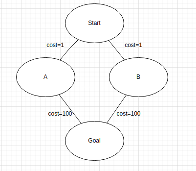

  ---

  - DFS will find the goal by just expanding A
  - A $\ast$ will find the goal by expanding B and A

###### 2. h(n)=0 is an admissible heuristic for the 8-puzzle.
  > true

  - Because the heuristic only has to give a smaller or equal number of steps than the optimal solution to be admissible
###### 3. A $\ast$ is of no use in robotics because percepts, states, and actions are continuous.
  > false

  - A $\ast$ still is of good use in robotics because A$\ast$ is good at creating a pathfinding solution when there is already prior knowledge given to the bot
###### 4. Breadth-first search is complete even if zero step costs are allowed.
  > true

  - Breadth first search will always find the solution eventually because even when there are zero-step costs, because it will iteratively find every possible path that the search can take. This will result in the Breadth first search taking n iterations, in which n is the number of steps that is in the optimal solution from the start to end node
###### 5. Assume that a rook can move on a chessboard any number of squares in a straight line, vertically or horizontally, but cannot jump over other pieces. Manhattan distance is an admissible heuristic for the problem of moving the rook from square A to square B in the smallest number of moves.
  > false

  - if a Rook is 5 squares north of the goal square, the Manhattan distance would be 5, but the rook could get to the goal in 1 move
## 3.22
###### Describe a state space in which iterative deepening search performs much worse than depth-first search (for example, O(n2) vs. O(n)).

---
  |---|---|---|---|---|---|---|---|---|---|---|
  |---|---|---|---|---|---|---|---|---|---|---|
  |---|---|---|---|---|---|---|---|---|---|---|
  |---|---|---|---|---|---|---|---|---|---|---|
  |---|---|---|---|---|---|---|---|---|---|---|
  |B|---|---|---|---|A|---|---|---|---|---|
  |---|---|---|---|---|---|---|---|---|---|---|
  |---|---|---|---|---|---|---|---|---|---|---|
  |---|---|---|---|---|---|---|---|---|---|---|
  |---|---|---|---|---|---|---|---|---|---|---|
---

- If the Depth first search is starting in the middle of an n by n grid, and it always expands the leftmost node first, Iterative deepening search would perform much worse on a large grid where the end goal is directly on the left side of the grid compared to regular depth first search
- The regular depth-first search would keep expanding the left-most nodes until it found the end goal, whereas the Iterative Deepening search would search all of the paths of length 1 around the start node, and then 2 around the start node, until it finally searches at the path length that is equal to the shortest path, so it will take $O(n^2)$, and regular DFS would take $O(n)$ time
- When DFS expands the leftmost node over every other node, it find B from A much faster than Iterative deepening search
## 3.27
###### Trace the operation of A search applied to the problem of getting to Bucharest from Lugoj using the straight-line distance heuristic. That is, show the sequence of nodes that the algorithm will consider and the f, g, and h score for each node.
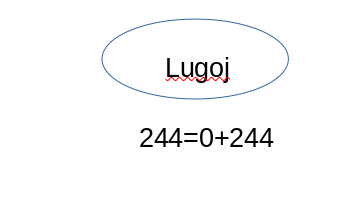
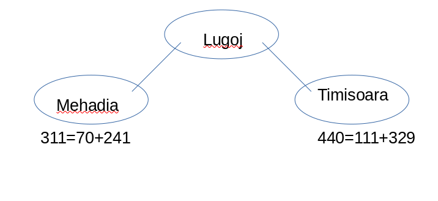
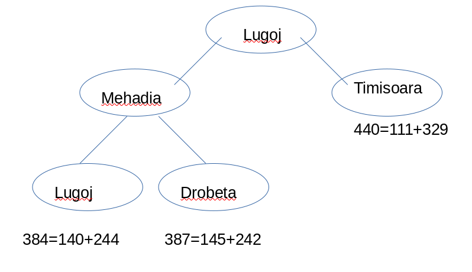
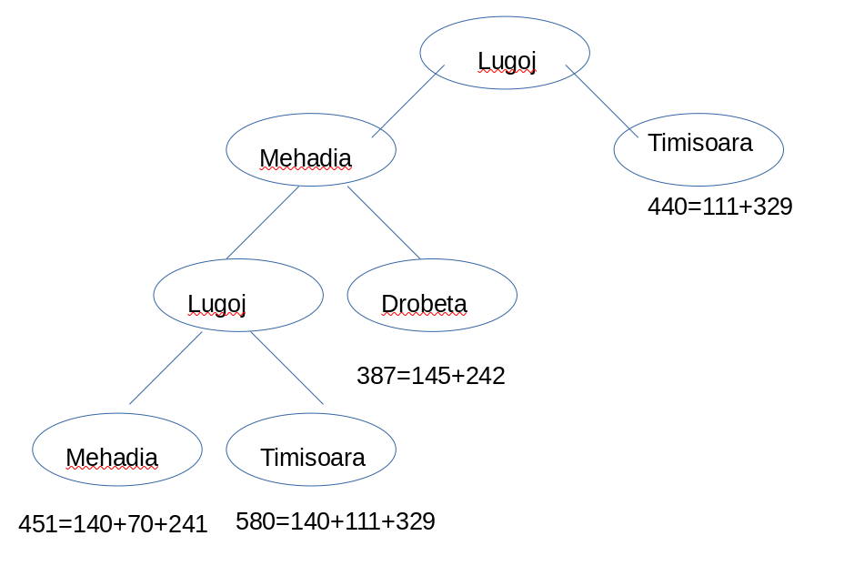
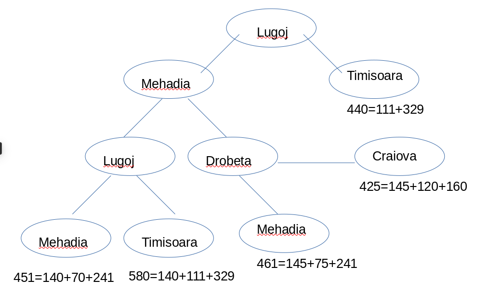
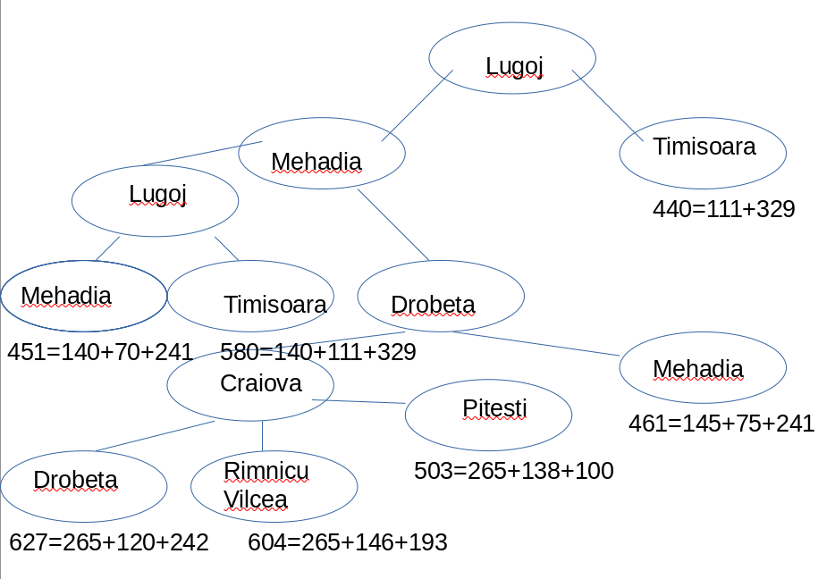
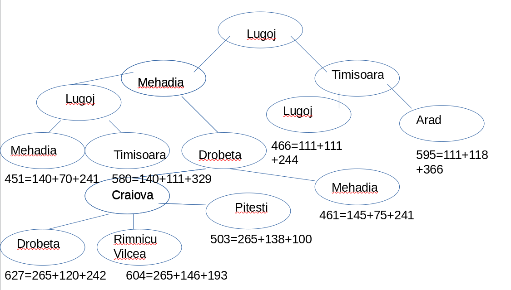
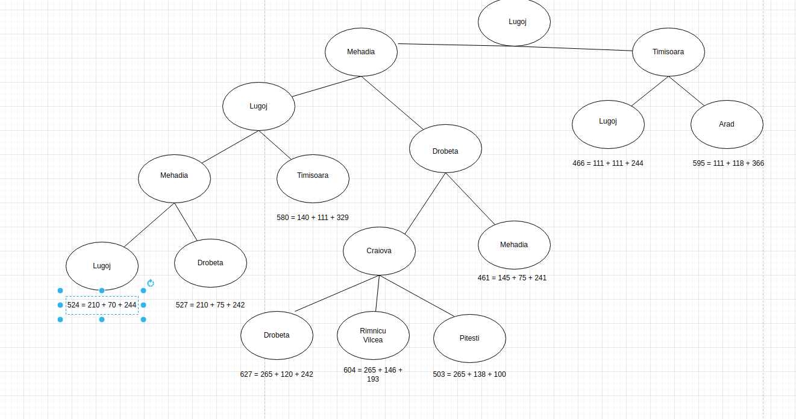
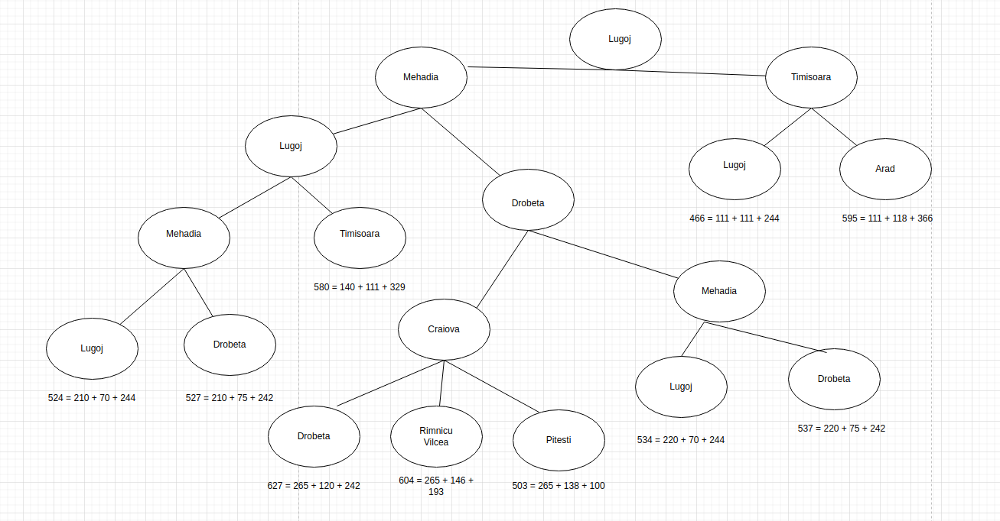
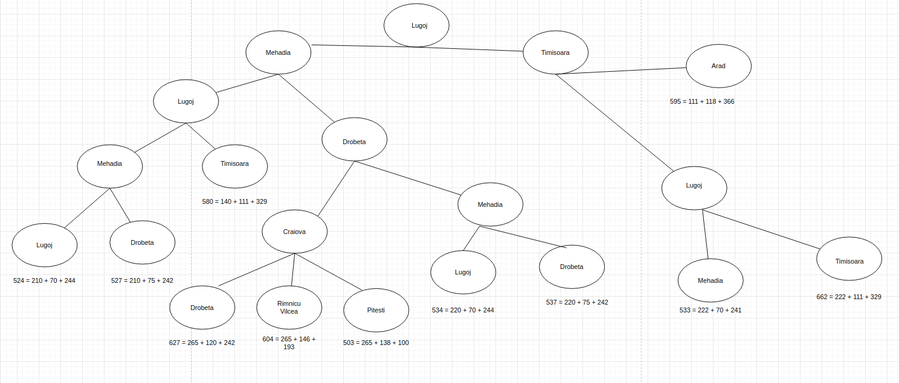
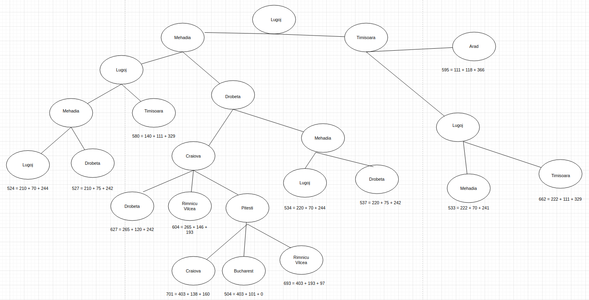
  - You have reached the solution of Bucharest
## 3.31
###### The heuristic path algorithm Pohl:1977 is a best-first search in which the evaluation function is f(n)=(2−w)g(n)+wh(n). For what values of w is this complete? For what values is it optimal, assuming that h is admissible? What kind of search does this perform for w=0, w=1, and w=2?
  - w is complete for any value less than or equal to 2
  - if h is admissible, then the value of 2 is optimal
    - when w is 0, it performs Universal cost, which is optimal and complete
    - when w is 1, it performs A $\ast$ search, which is optimal and complete
    - when w is 2, it performs Greedy Best-First Search, which is __not__ optimal and __not__ complete
