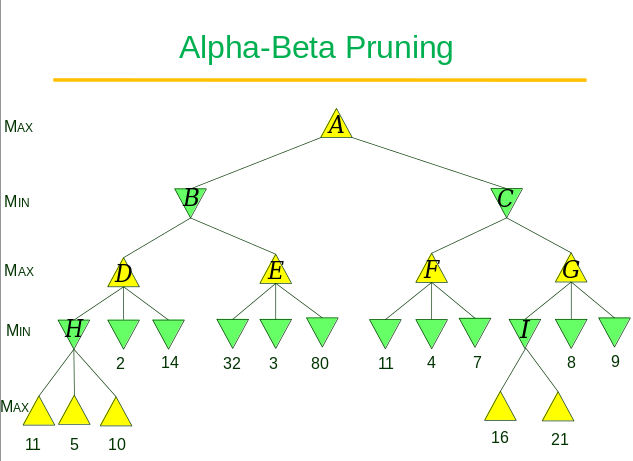

## Problem Set 3

#### By Ben Nguyen

## 5.8 (7+3+7+6 = 23 pts)

Consider the two-player game described in Figure 

1. Draw the complete game tree, using the following conventions:

- Write each state as (sA,sB), where sA and sB denote the token locations.

- Put each terminal state in a square box and write its game value in a circle.

- Put loop states (states that already appear on the path to the root) in double square boxes. Since their value is unclear, annotate each with a “?” in a circle.

2. Now mark each node with its backed-up minimax value (also in a circle). Explain how you handled the “?” values and why.

3. Explain why the standard minimax algorithm would fail on this game tree and briefly sketch how you might fix it, drawing on your answer to (b). Does your modified algorithm give optimal decisions for all games with loops?

Carried ? up until it gets ignored, treated it as an unknown state

Tried to solve until the minimax algorithm would throw out that path

4. This 4-square game can be generalized to n squares for any n>2. Prove that A wins if n is even and loses if n is odd.

Some induction maybe

## 5.9 (3+4+3+4+4 = 18 pts) 

This problem exercises the basic concepts of game playing, using tic-tac-toe (noughts and crosses) as an example. We define Xn as the number of rows, columns, or diagonals with exactly n X’s and no O’s. Similarly, On is the number of rows, columns, or diagonals with just n O’s. The utility function assigns +1 to any position with X3=1 and −1 to any position with O3=1. All other terminal positions have utility 0. For nonterminal positions, we use a linear evaluation function defined as Eval(s)=3X2(s)+X1(s)−(3O2(s)+O1(s)).

1. Approximately how many possible games of tic-tac-toe are there?

  $9!$ because each person can pick $K=9$ places at the start, then $K-1$ for each following move

2. Show the whole game tree starting from an empty board down to depth 2 (i.e., one X and one O on the board), taking symmetry into account.

3. Mark on your tree the evaluations of all the positions at depth 2.

4. Using the minimax algorithm, mark on your tree the backed-up values for the positions at depths 1 and 0, and use those values to choose the best starting move.

Best starting move would be in the middle

5. Circle the nodes at depth 2 that would not be evaluated if alpha–beta pruning were applied, assuming the nodes are generated in the optimal order for alpha–beta pruning.

## 5.14 (4+4+5+4 = 17 pts) 

Develop a formal proof of correctness for alpha–beta pruning. To do this, consider the situation shown in Figure . The question is whether to prune node nj, which is a max-node and a descendant of node n1. The basic idea is to prune it if and only if the minimax value of n1 can be shown to be independent of the value of nj.

1. Mode n1 takes on the minimum value among its children: n1=min(n2,n21,…,n2b2). Find a similar expression for n2 and hence an expression for n1 in terms of nj.

2. Let li be the minimum (or maximum) value of the nodes to the left of node ni at depth i, whose minimax value is already known. Similarly, let ri be the minimum (or maximum) value of the unexplored nodes to the right of ni at depth i. Rewrite your expression for n1 in terms of the li and ri values.

3. Now reformulate the expression to show that in order to affect n1, nj must not exceed a certain bound derived from the li values.

4. Repeat the process for the case where nj is a min-node.

#### Typo in part 1: the second argument of min is n_{21} (i.e., subscripts 21} not "n_2 1" (i.e., 1 as a product factor). 

## Extra problem (17 pts) 

You are given a minimax search tree as shown on the next page.  The
tree has nine internal nodes .  Not all terminal states (leaves) are 
at the same depth. 

Execute the alpha-beta pruning algorithm (use the version from the 3rd 
edition of the textbook in the lecture notes on February 15).

a. (6 pts) Mark all the subtrees (including leaves) that have been pruned.
    You may, for instance, simply put double slashes \\ or // across the edge 
    entering the root of such a subtree from the above.  

prune 80

prune 4 and 7

b. (8 pts) Next to each visited internal node, write down the two values  
    just before the return from the call MAX-VALUE or MIN-VALUE invoked on the 
    state represented by the node.

c. (3 pts) What is the final value for MAX at the root?
