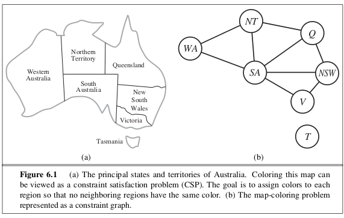

Com S 472/572 Spring 2022
Problem Set 4 (65 pts)

Due at 11:59pm
Thursday, Mar 24

All exercises are from https://aimacode.github.io/aima-exercises/


6.1 (5 pts)

How many solutions are there for the map-coloring problem in Figure 6.1? How many solutions if four colors are allowed? Two colors?

---



---

4 Colors:

- T gets all 4 choices

- SA gets 4 colors to choose from

- WA gets 3 choices bc can't choose SA's color

- NT gets 2 choices bc can't choose WA or SA

- Q gets 2 choices bc can't choose NT or SA

- NSW gets 2 choices bc can't choose Q or SA

- V gets 2 choices bc can't choose NSW or SA

4 x 4 x 3 x 2 x 2 x 2 x 2 = 768

2 Colors:

No solutions, because if WA is color 1, SA has to be the color 2, then NT can be neither color 1 or color 2.

---

6.6 (10 pts)

Show how a single ternary constraint such as $A+B=C$ can be turned into three binary constraints by using an auxiliary variable. You may assume finite domains.

(*Hint:* Consider a new variable that takes on values that are pairs of other values, and consider constraints such as $X$ is the first element of the pair $Y$.)

Next, show how constraints with more than three variables can be treated similarly.

Finally, show how unary constraints can be eliminated by altering the domains of variables. This completes the demonstration that any CSP can be transformed into a CSP with only binary constraints.

- $consider$ $D$

- $A$ $=$ $D(firstPair)$

- $B$ $=$ $D(secondPair)$

- $D(value)$ $=$ $D(sumOfPairs)$

- $Therefore$ $D=C$

6.11 (10 pts)

- partial assignment {WA = green, V = red}

---


---

- Use the AC-3 algorithm to show that arc consistency can detect the inconsistency of the partial assignment green, red for the problem shown in Figure 6.1.

available colors: Green, Red

```
queue = WA, SA, T, NT, Q, NSW, V
  WA=green
  SA=?
  T=?
  NT=?
  Q=?
  NSW=?
  V=red
```
```
queue = SA, T, NT, Q, NSW, V
  WA=green
  SA=?
  T=?
  NT=?
  Q=?
  NSW=?
  V=red
```
```
queue = T, NT, Q, NSW, V
  WA=green
  SA=red
  T=?
  NT=?
  Q=?
  NSW=?
  V=red
```
```
queue = NT, Q, NSW, V
  WA=green
  SA=red
  T=green
  NT=?
  Q=?
  NSW=?
  V=red
```
```
queue = Q, NSW, V
  WA=green
  SA=red
  T=green
  NT=(can't revise so backtrack)
  Q=?
  NSW=?
  V=red
```

6.20 (2+2+2+2=8 pts)

Consider the problem of tiling a surface (completely and exactly covering it) with n dominoes (2×1 rectangles). The surface is an arbitrary edge-connected (i.e., adjacent along an edge, not just a corner) collection of 2n 1×1 squares (e.g., a checkerboard, a checkerboard with some squares missing, a 10×1 row of squares, etc.).

1. Formulate this problem precisely as a CSP where the dominoes are the variables.

2. Formulate this problem precisely as a CSP where the squares are the variables, keeping the state space as small as possible. (*Hint:* does it matter which particular domino goes on a given pair of squares?)

3. Construct a surface consisting of 6 squares such that your CSP formulation from part (b) has a *tree-structured* constraint graph.

4. Describe exactly the set of solvable instances that have a tree-structured constraint graph.

7.4 (12 X 1 = 12 pts)

Which of the following are correct?

1. False ⊨ True.

> Correct

2. True ⊨ False.

> Incorrect

3. (A∧B) ⊨ (A⇔B).

> Correct

4. A⇔B ⊨ A∨B.

> Correct

5. A⇔B ⊨ ¬A∨B.

- (A⇒B)∧(B⇒A) ⊨ ¬A∨B.

- (!A∨B)∧(!B∨A) ⊨ ¬A∨B.

- Every time the first statement is true the first part of the and must also be true, meaning that this is true

> Correct

6. (A∧B)⇒C ⊨ (A⇒C)∨(B⇒C).

- !(A∧B)∨C ⊨ (!A∨C)∨(!B∨C).

- !A∨!B∨C ⊨ (!A∨C)∨(!B∨C).

- !A∨!B∨C ⊨ !A∨C∨!B∨C.

- !A∨!B∨C ⊨ !A∨!B∨C.

> Correct

7. (C∨(¬A∧¬B)) ≡ ((A⇒C)∧(B⇒C)).

- (C∨(¬A∧¬B)) ≡ (!A∨C)∧(!B∨C).

- (C∨(¬A∧¬B)) ≡ (!A∧!B)∨C.

> Correct

8. (A∨B)∧(¬C∨¬D∨E) ⊨ (A∨B).

- Every time the first statement is true the first part of the and must also be true, meaning that this is true

> Correct

9. (A∨B)∧(¬C∨¬D∨E) ⊨ (A∨B)∧(¬D∨E).

- Counter Example:

- A: True

- B: True

- C: False

- D: True

- E: False

> Incorrect

10. (A∨B)∧¬(A⇒B) is satisfiable.

- (A∨B)∧¬(!A∨B)

- (A∨B)∧(A∧!B)

- (A∨B)∧(A∧!B)

- A = True

- B = False

> Correct

11. (A⇔B)∧(¬A∨B) is satisfiable.

- (A⇒B)∧(B⇒A)∧(¬A∨B).

- (!A∨B)∧(!B∨A)∧(¬A∨B).

- A = False

- B = False

> Correct

12. (A⇔B)⇔C has the same number of models as (A⇔B) for any fixed set of proposition symbols that includes A, B, C.

7.6a, b, e (4+3+3 = 10 pts)

Prove each of the following assertions:
a. α is valid if and only if True⊨α.

True⊨False is false

True⊨True is True

therefore, α must always be true for the statement to be true

Therefore α must be valid

b. For any α, False⊨α.

- False⊨False is true.

- False⊨True is true.

- Therefore, False⊨α is always true because α can be either False or True and the statement will still be true

e. α⊨β if and only if the sentence (α∧¬β) is unsatisfiable.

- assume α = True

- True⊨β must also be true

- β must also be true by definition of ⊨.

- Therefore, (α∧¬β) cannot be satisfied

- Therefore, (α∧¬β) is unsatisfiable.

7.7 (2+4+4 = 10 pts)

Prove, or find a counterexample to, each of the following assertions:
1. If α⊨γ or β⊨γ (or both) then (α∧β)⊨γ
2. If (α∧β)⊨γ then α⊨γ or β⊨γ (or both).
3. If α⊨(β∨γ) then α⊨β or α⊨γ (or both).
