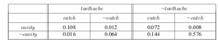
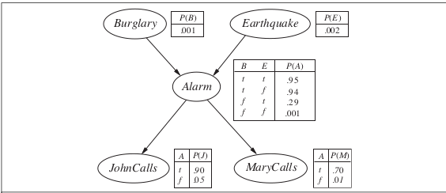

# Problem Set 7

By Ben Nguyen

## 13.3 (3 + 3 + 3 = 9 pts)

Prove true or give counter example

// look at slides for this one

a. If $P(a | b, c) = P(b | a, c)$, then $P(a | c) = P (b | c)$.

// kind of looks right

b. If $P(a | b, c) = P(a)$, then $P(b | c) = P(b)$.

Counter Example:

$P(a | b, c)$ = 100%

$P(a)$ = 100%

$P(b | c)$ = 10%

$P(b)$ = 5%

c. If $P(a | b) = P(a)$, then $P(a | b, c) = P(a | c)$.

// b does not matter to a, so probably true

## 13.8 (2 + 3 + 2 + 4 = 11 pts)

Given the full joint distribution shown in Figure 13.3, calculate the following:

// slides

1. P(Toothache).

.108 + .012 + .016 + .064 = 0.2

2. P(Cavity).

.108 + 0.012 + .072 + .008 = 0.2

3. P(Toothache | Cavity).

(.108 + 0.012) / 0.2 = 0.6

4. P(Cavity | Toothache ∨ Catch).

(.108 + 0.012 + 0.072) / 0.416 = 0.4615

## 13.18 (12 pts)

After your yearly checkup, the doctor has bad news and good news. The bad news is that you tested positive for a serious disease and that the test is 99% accurate (i.e., the probability of testing positive when you do have the disease is 0.99, as is the probability of testing negative when you don’t have the disease). The good news is that this is a rare disease, striking only 1 in 10,000 people of your age. Why is it good news that the disease is rare? What are the chances that you actually have the disease?

P(TestPositive | HaveDisease) = 0.99

P($\neg$ TestPositive | $\neg$ HaveDisease) = 0.99

P(HaveDisease) = 0.0001

P(HaveDisease | TestPositive) = $\frac{P(TestPositive | HaveDisease) * P(HaveDisease)}{P(TestPositive)}$

P(HaveDisease | TestPositive) = $\frac{P(TestPositive | HaveDisease) * P(HaveDisease)}{P(TestPositive | HaveDisease) * P(HaveDisease) + P(TestPositive | \neg HaveDisease) * P(\neg HaveDisease)}$

P(HaveDisease | TestPositive) = (0.99 * 0.0001) / (0.99 * 0.0001 + 0.01 * 0.9999)

P(HaveDisease | TestPositive) = (0.000099) / (0.010098)

P(HaveDisease | TestPositive) = 0.00980392156863

P(HaveDisease | TestPositive) = Approximately 0.98% chance

// TODO answer questions

## 13.26 (10 pts)

(Adapted from Pearl [Pearl:1988].) Suppose you are a witness to a nighttime hit-and-run accident involving a taxi in Athens. All taxis in Athens are blue or green. You swear, under oath, that the taxi was blue. Extensive testing shows that, under the dim lighting conditions, discrimination between blue and green is 75% reliable.

1. Is it possible to calculate the most likely color for the taxi? (*Hint:* distinguish carefully between the proposition that the taxi *is* blue and the proposition that it *appears* blue.)

P(TaxiColor = Blue | SawTaxiColor = Blue) = 0.75

P(TaxiColor = Green | SawTaxiColor = Blue) = 0.25

P(TaxiColor = Blue | SawTaxiColor = Green) = 0.25

P(TaxiColor = Green | SawTaxiColor = Green) = 0.75

Yes, P(TaxiColor = Blue | SawTaxiColor = Blue) \> P(TaxiColor = Green | SawTaxiColor = Blue)

Therefore, it is more likely for the actual taxi color to be Blue than for the actual taxi color to be Green

2. What if you know that 9 out of 10 Athenian taxis are green?

P(TaxiColor = Blue) = 0.1

P(TaxiColor = Green) = 0.9

// Bayes' Theorem probably

## 14.5 (3 + 9 = 13 pts)

Consider the Bayesian network in Figure burglary-figure.

1. If no evidence is observed, are Burglary and Earthquake independent? Prove this from the numerical semantics and from the topological semantics.

// prob are independent bc parent nodes

2. If we observe Alarm true, are Burglary and Earthquake independent? Justify your answer by calculating whether the probabilities involved satisfy the definition of conditional independence.

// prob true cuz proffy
